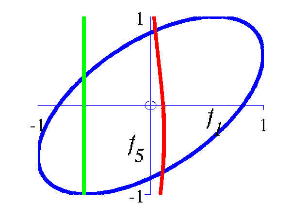
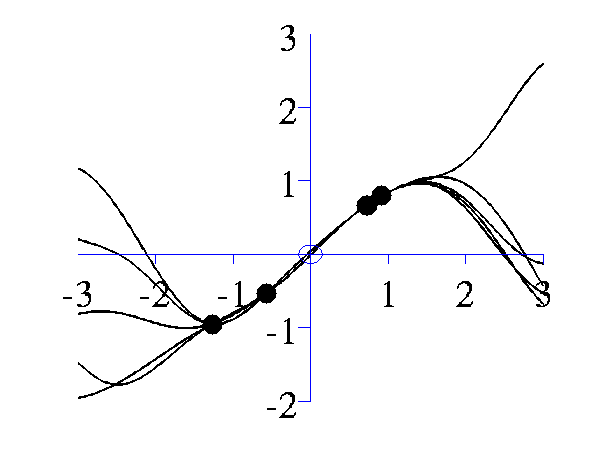
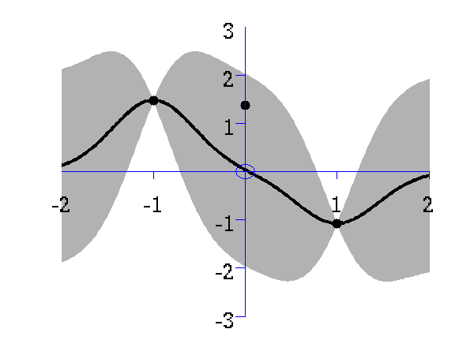
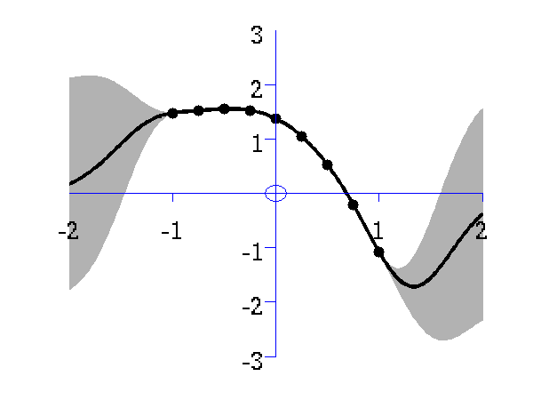
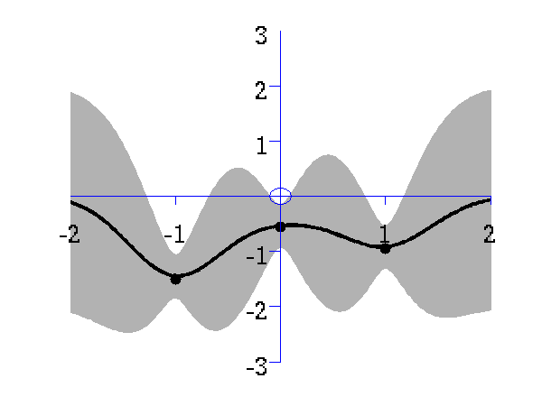
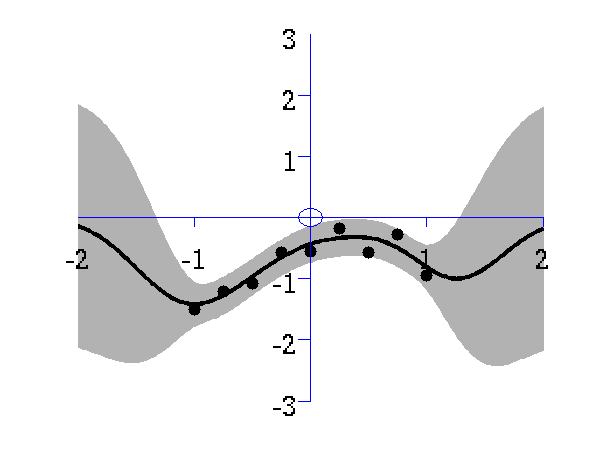
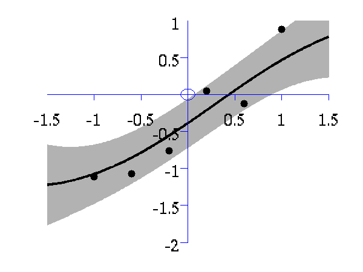
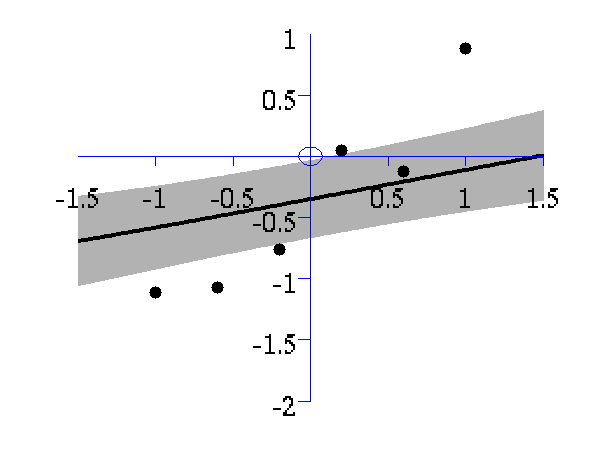
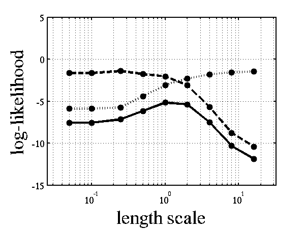

Gaussian Process Software
=========================

This page describes examples of how to use the Gaussian Process Software (GP).


Release Information
-------------------

**Current release is 0.137**.

As well as downloading the GP software you need to obtain the toolboxes specified below. 


For core functionality

- [netlab](https://github.com/sods/netlab) mainly used for optimization utilities (like scg).

- [prior](https://github.com/SheffieldML/prior) prior distributions.
- [optimi](https://github.com/SheffieldML/optimi) optimization constriant mappings.
- [kern](https://github.com/SheffieldML/kern) covariance functions.
- [ndlutil](https://github.com/SheffieldML/ndlutil) various utility functions.
- [noise](https://github.com/SheffieldML/noise) noise models.
- [mltools](https://github.com/SheffieldML/mltools) machine learning models.

- [Carl Rasmussen's minimize](http://learning.eng.cam.ac.uk/carl/code/minimize/m

For loading in data for demos

- [mocap](https://github.com/SheffieldML/datasets/)

For motion capture experiments

- [mocap](https://github.com/SheffieldML/mocap/)


Minor updates to gpLoadResult for allowing different functions for loading in data.

#### Version 0.136

Changes to gpReadFromFID for compatibility with C++ code.

#### Version 0.135

Modifications by Carl Henrik Ek for compatability with the SGPLVM toolbox.

#### Version 0.134

Updates to allow deconstruction of model files when writing to disk (gpWriteResult, gpLoadResult, gpDeconstruct, gpReconstruct).

#### Version 0.133

Updates for running a GPLVM/GP using the data's inner product matrix for Interspeech synthesis demos.

#### Version 0.132

Examples transfered from oxford toolbox, variational approximation from Titsias added as an option with 'dtcvar'.

#### Version 0.131

Changes to allow compatibility with SGPLVM and NCCA toolboxes.

#### Version 0.13

Changes to allow more flexibility in optimisation of beta.

#### Version 0.12

Various minor changes for enabling back constraints in hierarchical GP-LVM models.

#### Version 0.11

Changes include the use of the optimiDefaultConstraint('positive') to obtain the function to constrain beta to be positive (which now returns 'exp' rather than 'negLogLogit' which was previously the default). Similarly default optimiser is now given by a command in optimiDefaultOptimiser.

#### Version 0.1

The first version which is spun out of the FGPLVM toolbox. The corresponding FGPLVM toolbox is 0.15.

Release 0.1 splits away the Gaussian process section of the FGPLVM toolbox into this separate toolbox.

Other GP related software
-------------------------

The GP-LVM C++ software is available from [here](http://github.com/SheffieldML/gplvmcpp/).

The IVM C++ software is available from [here](http://github.com/SheffieldML/ivmcpp/).

The MATLAB IVM toolbox is available here [here](http://github.com/SheffieldML/ivm/).

The original MATLAB GP-LVM toolbox is available here [here](http://github.com/SheffieldML/gplvm/).

Examples
--------

### Functions from Gaussians

This example shows how points which look like they come from a function to be sampled from a Gaussian distribution. The sample is 25 dimensional and is from a Gaussian with a particular covariance.

```matlab
>> demGpSample
```


*Left* A single, 25 dimensional, sample from a Gaussian distribution. *Right* the covariance matrix of the Gaussian distribution..
### Joint Distribution over two Variables

Gaussian processes are about conditioning a Gaussian distribution on the training data to make the test predictions. To illustrate this process, we can look at the joint distribution over two variables.

```matlab
>> demGpCov2D([1 2])
```

Gives the joint distribution for *f*<sub>1</sub> and *f*<sub>2</sub>. The plots show the joint distributions as well as the conditional for *f*<sub>2</sub> given *f*<sub>1</sub>.



*Left* Blue line is contour of joint distribution over the variables *f*<sub>1</sub> and *f*<sub>2</sub>. Green line indicates an observation of *f*<sub>1</sub>. Red line is conditional distribution of *f*<sub>2</sub> given *f*<sub>1</sub>. *Right* Similar for *f*<sub>1</sub> and *f*<sub>5</sub>.
### Different Samples from Gaussian Processes

A script is provided which samples from a Gaussian process with the provided covariance function.

```matlab
>> gpSample('rbf', 10, [1 1], [-3 3], 1e5)
```

will give 10 samples from an RBF covariance function with a parameter vector given by [1 1] (inverse width 1, variance 1) across the range -3 to 3 on the *x*-axis. The random seed will be set to 1e5.

```
>> gpSample('rbf', 10, [16 1], [-3 3], 1e5)
```
is similar, but the inverse width is now set to 16 (length scale 0.25).


*Left* samples from an RBF style covariance function with length scale 1. *Right* samples from an RBF style covariance function with length scale 0.25.
Other covariance functions can be sampled, an interesting one is the MLP covariance which is non stationary and can produce point symmetric functions,

```matlab
>> gpSample('mlp', 10, [100 100 1], [-1 1], 1e5)
```

gives 10 samples from the MLP covariance function where the "bias variance" is 100 (basis functions are centered around the origin with standard deviation of 10) and the "weight variance" is 100.

```matlab
>> gpSample('mlp', 10, [100 1e-16 1], [-1 1], 1e5)
```

gives 10 samples from the MLP covariance function where the "bias variance" is approximately zero (basis functions are placed on the origin) and the "weight variance" is 100.


*Left* samples from an MLP style covariance function with bias and weight variances set to 100. *Right* samples from an MLP style covariance function with weight variance 100 and bias variance approximately zero.
### Posterior Samples

Gaussian processes are non-parametric models. They are specified by their covariance function and a mean function. When combined with data observations a posterior Gaussian process is induced. The demos below show samples from that posterior.

```matlab
>> gpPosteriorSample('rbf', 5, [1 1], [-3 3], 1e5)
```

and

```matlab
>> gpPosteriorSample('rbf', 5, [16 1], [-3 3], 1e5)
```



*Left* samples from the posterior induced by an RBF style covariance function with length scale 1 and 5 "training" data points taken from a sine wave. *Right* Similar but for a length scale of 0.25.

### Simple Interpolation Demo

This simple demonstration plots, consecutively, an increasing number of data points, followed by an interpolated fit through the data points using a Gaussian process. This is a noiseless system, and the data is sampled from a GP with a known covariance function. The curve is then recovered with minimal uncertainty after only nine data points are included. The code is run with

```matlab
>> demInterpolation
```


 Gaussian process prediction *left* after two points with a new data point sampled *right* after the new data point is included in the prediction.
 

Gaussian process prediction *left* after five points with a four new data point sampled *right* after all nine data points are included.

### Simple Regression Demo

The regression demo very much follows the format of the interpolation demo. Here the difference is that the data is sampled with noise. Fitting a model with noise means that the regression will not necessarily pass right through each data point. The code is run with

```matlab
>> demRegression
```


 Gaussian process prediction *left* after two points with a new data point sampled *right* after the new data point is included in the prediction.
 

Gaussian process prediction *left* after five points with a four new data point sampled *right* after all nine data points are included.

### Optimizing Hyper Parameters

One of the advantages of Gaussian processes over pure kernel interpretations of regression is the ability to select the hyper parameters of the kernel automatically. The demo

```matlab
>> demOptimiseGp
```

shows a series of plots of a Gaussian process with different length scales fitted to six data points. For each plot there is a corresponding plot of the log likelihood. The log likelihood peaks for a length scale equal to 1. This was the length scale used to generate the data.





From top left to bottom right, Gaussian process regression applied to the data with an increasing length scale. The length scales used were 0.05, 0.1, 0.25, 0.5, 1, 2, 4, 8 and 16.



Log-log plot of the log likelihood of the data against the length scales. The log likelihood is shown as a solid line. The log likelihood is made up of a data fit term (the quadratic form) shown by a dashed line and a complexity term (the log determinant) shown by a dotted line. The data fit is larger for short length scales, the complexity is larger for long length scales. The combination leads to a maximum around the true length scale value of 1.

### Regression over Motion Capture Markers

As a simple example of regression for real data we consider a motion capture data set. The data is [from Ohio State University](http://accad.osu.edu/research/mocap/mocap_data.htm). In the example script we perform Gaussian process regression with time as the input and the x,y,z position of the marker attached to the left ankle. To demonstrate the behavior of the model when the marker is lost, we remove data from This code can be run with

```matlab
>> demStickGp1 
```

The code will optimize hyper parameters and show plots of the posterior process through the training data and the missing test points.

The result of the script is given in the plot below.

  

Gaussian process regression through the x (left), y (middle) and z (right) position of the left ankle. Training data is shown as black spots, test points removed to simulate a lost marker are shown as circles, posterior mean prediction is shown as a black line and two standard deviations are given as grey shading.
Notice how the error bars are tight except in the region where the training data is missing and in the region where the training data disappears.

### Sparse Pseudo-input Gaussian Processes

The sparse approximation used in this toolbox is based on the Sparse Pseudo-input Gaussian Process model described by [Snelson and Ghahramani](http://ml.sheffield.ac.uk/~neil/cgi-bin/publications/bibpage.cgi?keyName=Snelson:pseudo05&printAbstract=1). Also provided are the extensions suggested by [Quiñonero-Candela and Rasmussen](http://ml.sheffield.ac.uk/~neil/cgi-bin/publications/bibpage.cgi?keyName=Quinonero:unifying05). They provide a unifying terminology for describing these approximations which we shall use in what follows.

There are three demos provided for Gaussian process regression in 1-D. They each use a different form of likelihood approximation. The first demonstration uses the "projected latent variable" approach first described by [Csato and Opper](http://ml.sheffield.ac.uk/~neil/cgi-bin/publications/bibpage.cgi?keyName=Csato:sparse02&printAbstract=1) and later used by [Seeger *et al.*](http://ml.sheffield.ac.uk/~neil/cgi-bin/publications/bibpage.cgi?keyName=Seeger:fast03&printAbstract=1). In the terminology of Quiñonero-Candela and Rasmussen (QR-terminology) this is known as the "deterministic training conditional" (DTC) approximation.

To use this approximation the following script can be run.

```matlab
>> demSpgp1dGp1 
```

The result of the script is given in the plot below.


Gaussian process using the DTC approximation with nine inducing variables. Data is shown as black spots, posterior mean prediction is shown as a black line and two standard deviations are given as grey shading.
The improved approximation suggested by Snelson and Ghahramani, in QR-terminology this is known as the fully independent training conditional (FITC). To try this approximation run the following script

```matlab
>> demSpgp1dGp2 
```

The result of the script is given on the left of the plot below.


*Left*: Gaussian process using the FITC approximation with nine inducing variables. Data is shown as black spots, posterior mean prediction is shown as a black line and two standard deviations are given as grey shading. *Right*: Similar but for the PITC approximation, again with nine inducing variables.
At the [Sheffield Gaussian Process Round Table](http://gpss.cc/gprt/) Lehel Csato pointed out that the Bayesian Committee Machine of [Schwaighofer and Tresp](http://ml.sheffield.ac.uk/~neil/cgi-bin/publications/bibpage.cgi?group=bcm&printAbstract=1) can also be viewed within the same framework. This idea is formalised in [Quiñonero-Candela and Rasmussen's](http://ml.sheffield.ac.uk/~neil/cgi-bin/publications/bibpage.cgi?keyName=Quinonero:unifying05&printAbstract=1) review. This approximation is known as the "partially independent training conditional" (PITC) in QR-terminology. To try this approximation run the following script

```matlab
>> demSpgp1dGp3
```

The result of the script is given on the right of the plot above.

Finally we can compare these results to the result from the full Gaussian process on the data with the correct hyper-parameters. To do this the following script can be run.

```matlab
>> demSpgp1dGp4
```

The result of the script is given in the plot below.


Full Gaussian process on the toy data with the correct hyper-parameters. Data is shown as black spots, posterior mean prediction is shown as a black line and two standard deviations are given as grey shaded area.

Page updated on Fri Jul 22 16:22:15 2011
