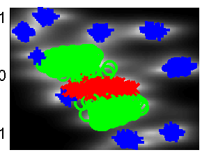
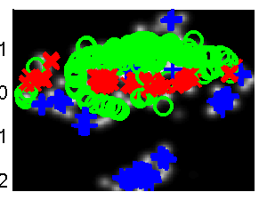
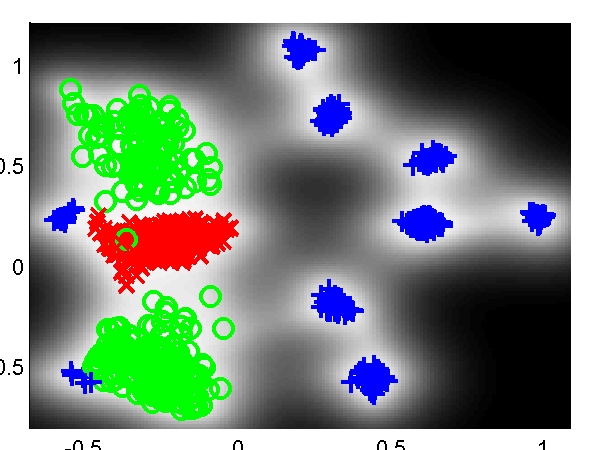
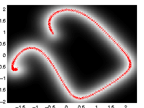
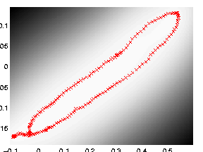
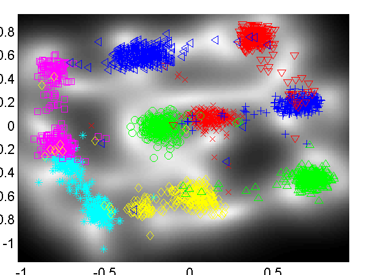
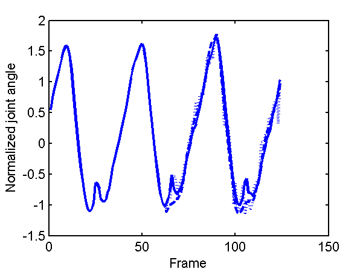

Faster GP-LVM Software
======================

This page describes examples of how to use the fast Gaussian process latent variable model Software (`fgplvm`). This toolbox allows for larger GP-LVM models through using the sparse approximations suggested in papers by authors including Titsias, Snelson, Ghahramani, Seeger, and Lawrence.


Release Information
-------------------

**Current release is 0.163**.

As well as downloading the `fgplvm` software you need to obtain the toolboxes specified below.

- [netlab](https://github.com/sods/netlab) mainly used for optimization utilities (like scg).

- [prior](https://github.com/SheffieldML/prior) prior distributions.
- [optimi](https://github.com/SheffieldML/optimi) optimization constriant mappings.
- [kern](https://github.com/SheffieldML/kern) covariance functions.
- [ndlutil](https://github.com/SheffieldML/ndlutil) various utility functions.
- [noise](https://github.com/SheffieldML/noise) noise models.

Required for demos

- [datasets](https://github.com/SheffieldML/datasets) dataset access.

Optional for motion capture experiments.

- [mocap](https://github.com/SheffieldML/mocap) loading in motion capture data.

Changes for compatibility with new SGPLVM toolbox by Carl Henrik Ek.

#### Version 0.162

Added new files fgplvmWriteResults fgplvmLoadResults for saving smaller model files.

#### Version 0.161

Updates for running a GPLVM when the inner produce matrix is used (i.e. dimensionality much greater than data points). Minor changes to fix reading of GPLVM files from latest C++ code.

#### Version 0.16

Incorporate varational approximation from Michalis in the code.

#### Version 0.153

Changes to allow compatibility with SGPLVM and NCCA toolboxes.

#### Version 0.152

Bug fix from fgplvmReadFromFID where the values of model.m weren't being computed correctly.

#### Version 0.151

In this version results for the CMU Mocap data set from [Taylor et al.](http://ml.sheffield.ac.uk/~neil/cgi-bin/publications/bibpage.cgi?keyName=Taylor:motion06&printAbstract=1) of subject 35 running and walking are included, as well as some minor changes to allow hierarchical GP-LVMs to be used.

#### Version 0.15

This version splits the Gaussian process portion into a new GP toolbox, the corresponding version is 0.1. Fixed bug in gpDynamicsExpandParam, gpDynamicsExractParam and gpDynamicsLogLikeGradient where 'fixInducing' option was not being dealt with.

Fixed bug in fgplvmCreate.m where the back constraints were set up, but the latent positions were not being set according to the back constraints in the returned model.

#### Version 0.141

Changed GP-LVM default optimiser to scg rather than conjgrad. Added fgplvmOptimiseSequence and dependent files. This is for optimising a test sequence in the latent space, for the case where there are dynamics on the model.

#### Version 0.14

Carl Ek implemented multiple sequences in the gpDynamics model used for dynamics in the GPLVM, this was refined and integrated by Neil.

Fixed two bugs in gpPosteriorGradMeanVar which appeared if fitc was used or the scales on the outputs were non-zero. This in turn affected fgplvmOptimisePoint.

Default under back constraints switched to not optimise towards a PCA initialisation.

Fixed bug in fgplvmReadFromFID where the old form of fgplvmCreate was being called.

#### Version 0.132

Release 0.132 includes two speed improvements on the pitc approximation. Thanks to [Ed Snelson](http://www.gatsby.ucl.ac.uk/~snelson/) for pointing out that it was unusually slow! New versions of the NDLUTIL and KERN toolbox are also required.

Release 0.131 adds the ability to handle missing data and a new reversible dynamics model.

Release 0.13 is a (hopefully) fairly stable base release for which several results in forthcoming papers will be created. Additional features are better decompartmentalisation of dynamics models, regularisation of inducing variable's inputs and introduction of fgplvmOptions and gpOptions for setting default options for the models.

Release 0.11 is the first release that contains the fully independent training conditional approximation (Snelson and Ghahramani, Quinonero Candela and Rasmussen).

Release 0.1 is a pre-release to make some of the model functionality available. The some of the different approximations (such as fully independent training conditional and partially independent training conditional) are not yet implemented and the dynamics currently has no sparse approximations associated.

This toolbox also implements back constraints (joint work with Joaquin Quinonero Candela). The mappings that can be used as back constraints are those described in [the MLTOOLS toolbox](http://github.com/SheffieldML/mltools/).

Alternative GP-LVM implementations from this site:

The GP-LVM C++ software is available from [here](http://github.com/SheffieldML/gplvmcpp/).

The original MATLAB version of the toolbox is available here [here](http://github.com/SheffieldML/gplvm/).

Examples
--------

### GP-LVM

The three approximations outlined above can be used to speed up learning in the GP-LVM. They have the advantage over the IVM approach taken in the [original GP-LVM toolbox](http://github.com/SheffieldML/gplvm/) that the algorithm is fully convergent and the final mapping from latent space to data space takes into account all of the data (not just the points in the active set).

As well as the new sparse approximation the new toolbox allows the GP-LVM to be run with dynamics as suggested by [Wang *et al.*](http://ml.sheffield.ac.uk/~neil/cgi-bin/publications/bibpage.cgi?keyName=Wang:gpdm05&printAbstract=1).

Finally, the new toolbox allows the incorporation of 'back constraints' in learning. Back constraints force the latent points to be a smooth function of the data points. This means that points that are close in data space are constrained to be close in latent space. For the standard GP-LVM points close in latent space are constrained to be close in data space, but the converse is not true.

Various combinations of back constraints and different approximations are used in the exmaples below.

### Oil Data

The 'oil data' is commonly used as a bench mark for visualisation algorithms. For more details on the data see [this page](http://inverseprobability.com/3PhaseData.html).

The [C++ implementation of the GP-LVM](http://github.com/SheffieldML/gplvmcpp) has details on training the full GP-LVM with this data set. Here we will consider the three different approximations outlined above.

#### FITC Approximation

In all the examples we give there will be 100 points in the active set. We first considered the FITC approximation. The script `demOilFgplvm1.m` runs the FITC approximation giving the result on the left of the figure shown below.



*Left*: GP-LVM on the oil data using the FITC approximation without back constraints. The phases of flow are shown as green circles, red crosses and blue plusses. One hundred inducing variables are used. *Right*: Similar but for a back-constrained GP-LVM, the back constraint is provided by a multi-layer perceptron with 15 hidden nodes.
Back constraints can be added to each of these approximations. In the example on the right we used a back constraint given by a multi-layer perceptron with 15 hidden nodes. This example can be recreated with `demOilFgplvm2.m`.

#### DTC Approximation

The other approximations can also be used, in the figures below we give results from the DTC approximation. The can be recreated using `demOil3.m` and `demOil4.m`.



*Left*: GP-LVM on the oil data using the DTC approximation without back constraints. The phases of flow are shown as green circles, red crosses and blue plusses. One hundred inducing variables are used. *Right*: Similar but for a back-constrained GP-LVM, the back constraint is provided by a multi-layer perceptron with 15 hidden nodes.
#### PITC Approximation

We also show results using the PITC approximation, these results can be recreated using the scripts `demOilFgplvm5.m` and `demOilFgplvm6.m`.


*Left*: GP-LVM on the oil data using the PITC approximation without back constraints. The phases of flow are shown as green circles, red crosses and blue plusses. One hundred inducing variables are used. *Right*: Similar but for a back-constrained GP-LVM, the back constraint is provided by a multi-layer perceptron with 15 hidden nodes.

#### Variational DTC Approximation

Finally we also show results using the variational DTC approximation of Titsias, these results can be recreated using the scripts `demOilFgplvm7.m` and `demOilFgplvm8.m`.



*Left*: GP-LVM on the oil data using the variational DTC approximation without back constraints. The phases of flow are shown as green circles, red crosses and blue plusses. One hundred inducing variables are used. *Right*: Similar but for a back-constrained GP-LVM, the back constraint is provided by a multi-layer perceptron with 15 hidden nodes.

### Back Constraints and Dynamics

First we will demonstrate the dynamics functionality of the toolbox. We raw x-y-z values from a motion capture data set, the `Figure Run 1` example available [from Ohio State University](http://accad.osu.edu/research/mocap/mocap_data.htm). To run without dynamics use the script:

```matlab
>> demStickFgplvm1
```

The results are given on the left of the figure below.


GP-LVM on the motion capture data without dynamics in the latent space.
Notice that the sequence (which is a few strides of a man running) is split into several sub-sequences. These sub-sequences are aligned to the strides of the man. By introducing a dynamics prior, we can force the sequence to link up. Samples from the dynamics prior used are shown in the plot below.


 

Samples from the dynamics prior which is placed over the latent space. This prior has *Left*: GP-LVM on the motion capture data without dynamics in the latent space. *Right*: GP-LVM with dynamics. Samples from the dynamics prior used are given in the figure above.
This prior is used in the model to obtain the results below,

```matlab
>> demStickFgplvm2
```


GP-LVM with dynamics. Samples from the dynamics prior used are given in the figure above.
Note now the circular form of the latent space. Back constraints can also be used to achieve a similar effect,

```matlab
>> demStickFgplvm3
```


GP-LVM with back constraints. A RBF kernel mapping was used to form the back constraints with the inverse width set to 1e-4 (*i.e.*length scale set to 100).

### Loop Closure in Robotics

In on-going work with Dieter Fox and Brian Ferris at the University of Washington we are interested in loop closure for robotic navigation, included as an example is a data set of a robot completing a loop while reading wireless access point signal strengths. To produce a neat track and close the loop it turns out it is necessary to use dynamics and back constraints as seen in the images below. These results can be recreated with
`demRobotWireless1.m` through `demRobotWireless4.m`.




Use of back constraints and dynamics to obtain loop closure in a robot navigation example. *Top Left*: GP-LVM without back constraints or dynamics, *Top right*: GP-LVM with back constraints, no dynamics, *Bottom Left*: GP-LVM with dynamics, no back constraints, *Bottom right*: GP-LVM with back constraints and dynamics.

### Vocal Joystick and Vowel Data

Another ongoing piece of work with Jeff Bilmes and Jon Malkin involves embedding vowel sounds in a two dimensional space as part of [vocal joystick](http://ssli.ee.washington.edu/vj) system. Jon has provided a simple data set of 2,700 examples of different vowels. These are embedded in a two dimensional latent space with and without back constraints.



*Left*: embedding of the vowel data without back constraints, *Right*: embedding of the vowel data with back constraints. */a/* - red cross, */ae/* - green circle, */ao/* - blue plus, */e/* - cyan asterix, */i/* - magenta square, */ibar/* - yellow diamond, */o/* - red down triangle, */schwa/* - green up triangle, */u/* - blue left triangle.

### Larger Human Motion Data Sets

For [an AISTATS paper](http://ml.sheffield.ac.uk/~neil/cgi-bin/publications/bibpage.cgi?keyName=Lawrence:larger07&printAbstract=1) we recreated an experiment from [Taylor *et al.*'s NIPS paper](http://ml.sheffield.ac.uk/~neil/cgi-bin/publications/bibpage.cgi?keyName=Taylor:motion06&printAbstract=1). They created a data set from a motion capture data in the [CMU data base](http://mocap.cs.cmu.edu) of running and walking. The data set can now be recreated using the [DATASETS toolbox](http://github.com/SheffieldML/datasets/). We repeated missing data experiments by Taylor et al.. The model learning for these experiments can be recreated with:

```matlab
>> demCmu35gplvm1
```

for the four dimensional latent space, `demCmu35gplvm2` for the three dimensional latent space and `demCmu35gplvm3` for the five dimensional latent space. The test data reconstruction can then be performed for all models with `demCmu35gplvmReconstruct`. Taylor *et al.*'s nearest neighbour results can be recreated using `demCmu35TaylorNearestNeighbour`.

Data was pre-processed by mapping angles to be between -180 and 180 and scaling the data such that the variance of each dimension was one.

The quality of the trained model was evaluated using a missing data problem with a test sequence of data. The model was required to fill in either upper body angles or right leg angles. Results for the GP-LVM and nearest neighbour in both scaled space and original angle space are given in the table below.

<table>
<colgroup>
<col width="20%" />
<col width="20%" />
<col width="20%" />
<col width="20%" />
<col width="20%" />
</colgroup>
<tbody>
<tr class="odd">
<td align="left"></td>
<td align="left">Leg Cumulative Scaled</td>
<td align="left">Leg RMS Angles</td>
<td align="left">Body Cumulative Scaled</td>
<td align="left">Body RMS Angles</td>
</tr>
<tr class="even">
<td align="left">GP-LVM (<em>q</em>=3)</td>
<td align="left">11.4</td>
<td align="left">3.40</td>
<td align="left"><strong>16.9</strong></td>
<td align="left"><strong>2.49</strong></td>
</tr>
<tr class="odd">
<td align="left">GP-LVM (<em>q</em>=4)</td>
<td align="left"><strong>9.7</strong></td>
<td align="left"><strong>3.38</strong></td>
<td align="left">20.7</td>
<td align="left">2.72</td>
</tr>
<tr class="even">
<td align="left">GP-LVM (<em>q</em>=5)</td>
<td align="left"><strong>13.4</strong></td>
<td align="left">4.25</td>
<td align="left">23.4</td>
<td align="left">2.78</td>
</tr>
<tr class="odd">
<td align="left">Scaled NN</td>
<td align="left"><strong>13.5</strong></td>
<td align="left">4.44</td>
<td align="left">20.8</td>
<td align="left">2.62</td>
</tr>
<tr class="even">
<td align="left">Nearest Neighbour</td>
<td align="left"><strong>14.0</strong></td>
<td align="left">4.11</td>
<td align="left">30.9</td>
<td align="left">3.20</td>
</tr>
</tbody>
</table>

The cumulative scaled error is a recreation of the error reported in Taylor *et al.* which was the average (across angles) cumulative sum (across time) of the squared errors in the down-scaled (*i.e.* variance one) space of angles. We also present the root mean squared angle error for each joint which we find to be a little easier to interpret.

Taylor *et al.* used a slightly different representation of the data set which included the absolute *x* and *z* position of the root node and rotation around the *y*-axis. For this data set, this information does help, principally because the subject seems to start in roughly the same position at the beginning of each sequence. However, in general absolute position will not help, so we discarded it in favour of a representation of these values in terms of differences between frames. Finally Taylor *et al.* concatenated two frames to form each data point for the model. We chose not to do this as we wanted to test the ability of the Gaussian process dynamics to fully recreate the data set. There results are given in their paper and summarised below.
<table>
<colgroup>
<col width="33%" />
<col width="33%" />
<col width="33%" />
</colgroup>
<tbody>
<tr class="odd">
<td align="left"></td>
<td align="left">Leg Cumulative Scaled</td>
<td align="left">Body Cumulative Scaled</td>
</tr>
<tr class="even">
<td align="left">Binary Latent Variable Model</td>
<td align="left"><strong>11.7</strong></td>
<td align="left"><strong>8.8</strong></td>
</tr>
<tr class="odd">
<td align="left">Scaled NN</td>
<td align="left">22.2</td>
<td align="left">20.5</td>
</tr>
</tbody>
</table>

Finally we show a plot of reconstructions of two of the angles in the data.



Prediction for first two angles of the right hip joint (see plots in [Taylor *et al.*](http://ml.sheffield.ac.uk/~neil/cgi-bin/publications/bibpage.cgi?keyName=Taylor:motion06&printAbstract=1) for comparison). Dotted line is nearest neighour in scaled space, dashed line is GP-LVM with 4-D latent space.

Page updated on Wed May 19 10:04:54 2010


