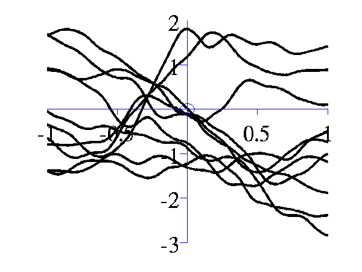
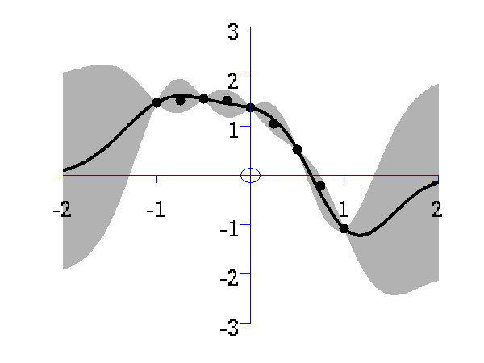
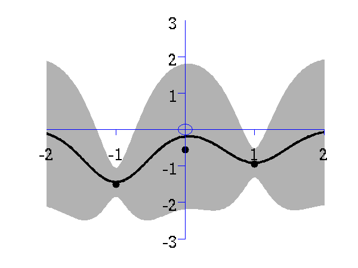
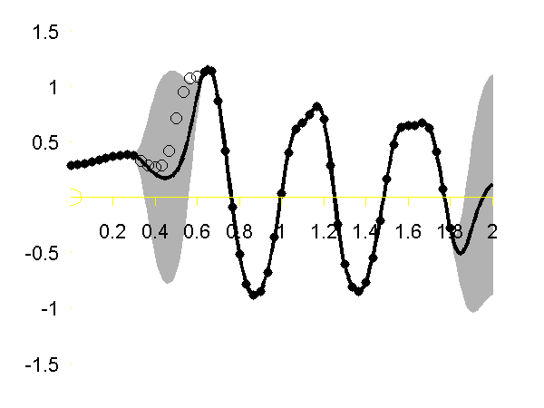
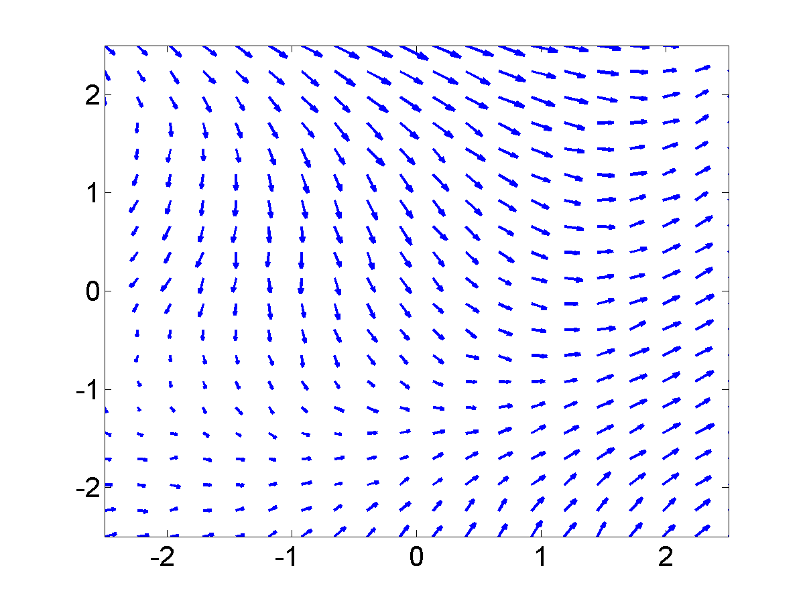
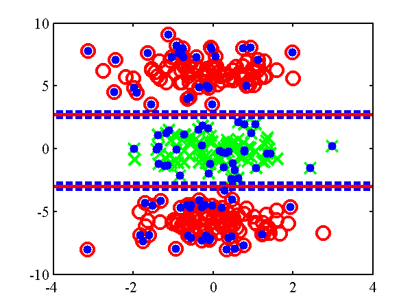
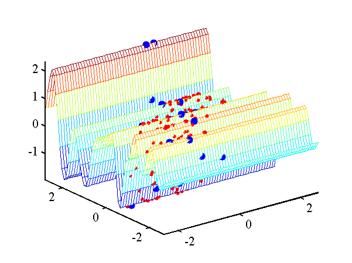
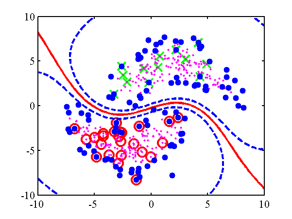
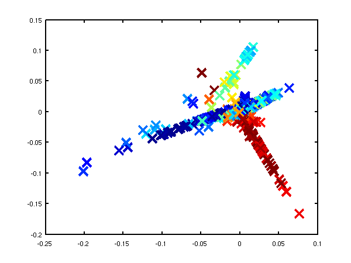
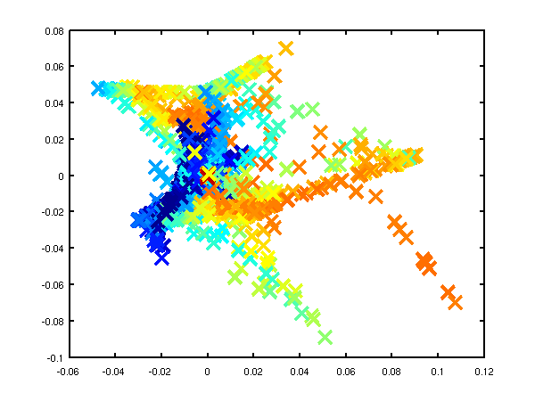

GPmat
====

The GPmat toolbox is the 'one stop shop' on github for a number of dependent toolboxes, each of which used to be released independently. Since May 2015 each toolbox is a sub-directory within GPmat. They are included as subtrees from the relevant repositories.

The summary of demos from each toolbox is given below. It is advisable that you also include netlab (https://github.com/sods/netlab) as a dependency.

The first release of the full GPmat toolbox is version 1.0.0, released on 28th May 2015 to coincide with the reformatting of the toolbox as sub-trees. 

GP
==

### Version 0.136


Changes to gpReadFromFID for compatibility with C++ code.

#### Version 0.135

Modifications by Carl Henrik Ek for compatability with the SGPLVM toolbox.

#### Version 0.134

Updates to allow deconstruction of model files when writing to disk (gpWriteResult, gpLoadResult, gpDeconstruct, gpReconstruct).

#### Version 0.133

Updates for running a GPLVM/GP using the data's inner product matrix for Interspeech synthesis demos.

#### Version 0.132

Examples transfered from oxford toolbox, variational approximation from Titsias added as an option with 'dtcvar'.

#### Version 0.131

Changes to allow compatibility with SGPLVM and NCCA toolboxes.

#### Version 0.13

Changes to allow more flexibility in optimisation of beta.

#### Version 0.12

Various minor changes for enabling back constraints in hierarchical
GP-LVM models.

#### Version 0.11

Changes include the use of the optimiDefaultConstraint('positive') to
obtain the function to constrain beta to be positive (which now
returns 'exp' rather than 'negLogLogit' which was previously the
default). Similarly default optimiser is now given by a command in
optimiDefaultOptimiser.

#### Version 0.1

The first version which is spun out of the FGPLVM toolbox. The
corresponding FGPLVM toolbox is 0.15.


Release 0.1 splits away the Gaussian process section of the FGPLVM
toolbox into this separate toolbox.

## Other GP related software

The GP-LVM C++ software is available from <a
href="/~neill/gplvmcpp/">here</a>.

The IVM C++ software is available from <a
href="/~neill/ivmcpp/">here</a>.

The MATLAB IVM toolbox is available here <a
href="/~neill/ivm/">here</a>.

The original MATLAB GP-LVM toolbox is available here <a
href="/~neill/gplvm/">here</a>.


## Examples


### Functions from Gaussians

This example shows how points which look like they come from a
function to be sampled from a Gaussian distribution. The sample is 25
dimensional and is from a Gaussian with a particular covariance.

```matlab
>> demGpSample
```

<center><br> <i>Left</i> A single, 25
dimensional, sample from a Gaussian distribution. <i>Right</i> the
covariance matrix of the Gaussian distribution..  </center>


### Joint Distribution over two Variables

Gaussian processes are about conditioning a Gaussian distribution
on the training data to make the test predictions. To illustrate this
process, we can look at the joint distribution over two variables.

```matlab
>> demGpCov2D([1 2])
```

Gives the joint distribution for <i>f</i><sub>1</sub> and
<i>f</i><sub>2</sub>. The plots show the joint distributions as well
as the conditional for <i>f</i><sub>2</sub> given
<i>f</i><sub>1</sub>.

<center><br> <i>Left</i> Blue line is
contour of joint distribution over the variables <i>f</i><sub>1</sub>
and <i>f</i><sub>2</sub>. Green line indicates an observation of
<i>f</i><sub>1</sub>. Red line is conditional distribution of
<i>f</i><sub>2</sub> given <i>f</i><sub>1</sub>. <i>Right</i> Similar
for <i>f</i><sub>1</sub> and <i>f</i><sub>5</sub>.  </center>


### Different Samples from Gaussian Processes

A script is provided which samples from a Gaussian process with the
provided covariance function.

```matlab
>> gpSample('rbf', 10, [1 1], [-3 3], 1e5)
```

will give 10 samples from an RBF covariance function with a
parameter vector given by [1 1] (inverse width 1, variance 1) across
the range -3 to 3 on the <i>x</i>-axis. The random seed will be set to
1e5.

```matlab
>> gpSample('rbf', 10, [16 1], [-3 3], 1e5)
```

is similar, but the inverse width is now set to 16 (length scale 0.25).

<center><br> <i>Left</i> samples from an RBF style covariance function
with length scale 1. <i>Right</i> samples from an RBF style covariance
function with length scale 0.25.  </center>

Other covariance functions can be sampled, an interesting one is
the MLP covariance which is non stationary and can produce point
symmetric functions,


```matlab
>> gpSample('mlp', 10, [100 100 1], [-1 1], 1e5)
```

gives 10 samples from the MLP covariance function where the &quot;bias
variance&quot; is 100 (basis functions are centered around the origin
with standard deviation of 10) and the &quot;weight variance&quot; is
100.

```matlab
>> gpSample('mlp', 10, [100 1e-16 1], [-1 1], 1e5)
```

gives 10 samples from the MLP covariance function where the &quot;bias
variance&quot; is approximately zero (basis functions are placed on
the origin) and the &quot;weight variance&quot; is 100.

<center><br> <i>Left</i> samples from an MLP style covariance
function with bias and weight variances set to 100. <i>Right</i>
samples from an MLP style covariance function with weight variance 100
and bias variance approximately zero.  </center>


### Posterior Samples

Gaussian processes are non-parametric models. They are specified by their covariance function and a mean function. When combined with data observations a posterior Gaussian process is induced. The demos below show samples from that posterior.

```matlab
>>  gpPosteriorSample('rbf', 5, [1 1], [-3 3], 1e5)
```

and 

```matlab
>>  gpPosteriorSample('rbf', 5, [16 1], [-3 3], 1e5)
```

<center><br> <i>Left</i> samples from the posterior induced by an RBF style covariance function
with length scale 1 and 5 &quot;training&quot; data points taken from a sine wave. <i>Right</i> Similar but for a length scale of 0.25.  </center>


### Simple Interpolation Demo


This simple demonstration plots, consecutively, an increasing
number of data points, followed by an interpolated fit through the
data points using a Gaussian process. This is a noiseless system, and
the data is sampled from a GP with a known covariance function. The
curve is then recovered with minimal uncertainty after only nine data
points are included. The code is run with

```matlab
>> demInterpolation
```

<center><br>

Gaussian process prediction <i>left</i> after two points with a new
data point sampled <i>right</i> after the new data point is included
in the prediction.<br> 

<br>

Gaussian process prediction <i>left</i> after five points with a four
new data point sampled <i>right</i> after all nine data points are
included.<br> </center>

### Simple Regression Demo

The regression demo very much follows the format of the
interpolation demo. Here the difference is that the data is sampled
with noise. Fitting a model with noise means that the regression will
not necessarily pass right through each data point.

The code is run with

```matlab
>> demRegression
```


<center><br>

Gaussian process prediction <i>left</i> after two points with a new
data point sampled <i>right</i> after the new data point is included
in the prediction.<br> <br>

Gaussian process prediction <i>left</i> after five points with a four
new data point sampled <i>right</i> after all nine data points are
included.<br> </center>

### Optimizing Hyper Parameters

One of the advantages of Gaussian processes over pure kernel
interpretations of regression is the ability to select the hyper
parameters of the kernel automatically. The demo

```matlab
>> demOptimiseGp
```

shows a series of plots of a Gaussian process with different length
scales fitted to six data points. For each plot there is a
corresponding plot of the log likelihood. The log likelihood peaks for
a length scale equal to 1. This was the length scale used to generate
the data.

<center><br><br><br>From top left to bottom right, Gaussian process
regression applied to the data with an increasing length scale. The
length scales used were 0.05, 0.1, 0.25, 0.5, 1, 2, 4, 8 and
16.<br><br>Log-log plot of
the log likelihood of the data against the length scales. The log
likelihood is shown as a solid line. The log likelihood is made up of
a data fit term (the quadratic form) shown by a dashed line and a
complexity term (the log determinant) shown by a dotted line. The data
fit is larger for short length scales, the complexity is larger for
long length scales. The combination leads to a maximum around the true
length scale value of 1.</center>

### Regression over Motion Capture Markers

As a simple example of regression for real data we consider a motion capture data set. The data is <a href="http://accad.osu.edu/research/mocap/mocap_data.htm">from Ohio State University</a>. In the example script we perform Gaussian process regression with time as the input and the x,y,z position of the marker attached to the left ankle. To demonstrate the behavior of the model when the marker is lost, we remove data from This code can be run with

```matlab 
>> demStickGp1 
``` 

The code will optimize hyper parameters and show plots of the posterior process through the training data and the missing test points.

The result of the script is given in the plot below.  

<center>  <br> Gaussian process regression through the x (left), y (middle) and z (right) position of the left ankle. Training data is shown as black spots, test points removed to simulate a lost marker are shown as circles, posterior mean
prediction is shown as a black line and two standard deviations are
given as grey shading.</center>

Notice how the error bars are tight except in the region where the training data is missing and in the region where the training data disappears.

### Sparse Pseudo-input Gaussian Processes

The sparse approximation used in this toolbox is based on the
Sparse Pseudo-input Gaussian Process model described by <a
href="http://ml.sheffield.ac.uk/~neil/cgi-bin/publications/bibpage.cgi?keyName=Snelson:pseudo05&printAbstract=1">Snelson
and Ghahramani</a>. Also provided are the extensions suggested by <a
href="http://ml.sheffield.ac.uk/~neil/cgi-bin/publications/bibpage.cgi?keyName=Quinonero:unifying05">Qui&ntilde;onero-Candela
and Rasmussen</a>. They provide a unifying terminology for describing
these approximations which we shall use in what follows.

There are three demos provided for Gaussian process regression in
1-D. They each use a different form of likelihood approximation. The
first demonstration uses the &quot;projected latent variable&quot;
approach first described by <a
href="http://ml.sheffield.ac.uk/~neil/cgi-bin/publications/bibpage.cgi?keyName=Csato:sparse02&printAbstract=1">Csato
and Opper</a> and later used by <a
href="http://ml.sheffield.ac.uk/~neil/cgi-bin/publications/bibpage.cgi?keyName=Seeger:fast03&printAbstract=1">Seeger
<i>et al.</i></a>. In the terminology of Qui&ntilde;onero-Candela and
Rasmussen (QR-terminology) this is known as the &quot;deterministic
training conditional&quot; (DTC) approximation.

To use this approximation the following script can be run.

```matlab 
>> demSpgp1dGp1 
``` 

The result of the script is
given in the plot below.  

<center><br> Gaussian process using the DTC approximation with nine
inducing variables. Data is shown as black spots, posterior mean
prediction is shown as a black line and two standard deviations are
given as grey shading.</center>

The improved approximation suggested by Snelson and Ghahramani, in
QR-terminology this is known as the fully independent training
conditional (FITC). To try this approximation run the following script

```matlab 
>> demSpgp1dGp2 
```

The result of the script is given on the left of the plot below.

<center><br>

<i>Left</i>: Gaussian process using the FITC approximation with nine
inducing variables. Data is shown as black spots, posterior mean
prediction is shown as a black line and two standard deviations are
given as grey shading. <i>Right</i>: Similar but for the PITC
approximation, again with nine inducing variables.</center>

At the <a href="http://www.dcs.shef.ac.uk/ml/gprt/">Sheffield
Gaussian Process Round Table</a> Lehel Csato pointed out that the
Bayesian Committee Machine of <a
href="http://ml.sheffield.ac.uk/~neil/cgi-bin/publications/bibpage.cgi?group=bcm&printAbstract=1">Schwaighofer
and Tresp</a> can also be viewed within the same framework. This idea
is formalised in <a
href="http://ml.sheffield.ac.uk/~neil/cgi-bin/publications/bibpage.cgi?keyName=Quinonero:unifying05&printAbstract=1">Qui&ntilde;onero-Candela
and Rasmussen's</a> review. This approximation is known as the
&quot;partially independent training conditional&quot; (PITC) in
QR-terminology. To try this approximation run the following script

```matlab
>> demSpgp1dGp3
```

The result of the script is given on the right of the plot above.

Finally we can compare these results to the result from the full
Gaussian process on the data with the correct hyper-parameters. To do
this the following script can be run.

```matlab
>> demSpgp1dGp4
```

The result of the script is given in the plot below.

<center><br> Full Gaussian
process on the toy data with the correct hyper-parameters. Data is
shown as black spots, posterior mean prediction is shown as a black
line and two standard deviations are given as grey shaded
area.</center>

GP-LVM
======

Changes for compatibility with new SGPLVM toolbox by Carl Henrik Ek.

#### Version 0.162

Added new files fgplvmWriteResults fgplvmLoadResults for saving smaller model files.

#### Version 0.161

Updates for running a GPLVM when the inner produce matrix is used
(i.e. dimensionality much greater than data points).  Minor changes to
fix reading of GPLVM files from latest C++ code.

#### Version 0.16

Incorporate varational approximation from Michalis in the code. 

#### Version 0.153

Changes to allow compatibility with SGPLVM and NCCA toolboxes.


#### Version 0.152

Bug fix from fgplvmReadFromFID where the values of model.m weren't being computed correctly.

#### Version 0.151

In this version results for the CMU Mocap data set from <a href="http://ml.sheffield.ac.uk/~neil/cgi-bin/publications/bibpage.cgi?keyName=Taylor:motion06&printAbstract=1">Taylor et al.</a> of subject 35 running and walking are included, as well as some minor changes to allow hierarchical GP-LVMs to be used.


#### Version 0.15

This version splits the Gaussian process portion into a new GP toolbox, the corresponding version is 0.1. Fixed bug in gpDynamicsExpandParam, gpDynamicsExractParam and gpDynamicsLogLikeGradient where 'fixInducing' option  was not being dealt with.

Fixed bug in fgplvmCreate.m where the back constraints were set up, but the latent positions were not being set according to the back constraints in the returned model.

#### Version 0.141

Changed GP-LVM default optimiser to scg rather than conjgrad. Added fgplvmOptimiseSequence and dependent files. This is for optimising a test sequence in the latent space, for the case where there are dynamics on the model.

#### Version 0.14

Carl Ek implemented multiple sequences in the gpDynamics model used for dynamics in the GPLVM, this was refined and integrated by Neil.

Fixed two bugs in gpPosteriorGradMeanVar which appeared if fitc was used or the scales on the outputs were non-zero. This in turn affected fgplvmOptimisePoint.

Default under back constraints switched to not optimise towards a PCA initialisation.

Fixed bug in fgplvmReadFromFID where the old form of fgplvmCreate was being called.


#### Version 0.132

Release 0.132 includes two speed improvements on the pitc approximation. Thanks to <a href="http://www.gatsby.ucl.ac.uk/~snelson/">Ed Snelson</a> for pointing out that it was unusually slow! New versions of the NDLUTIL and KERN toolbox are also required.

Release 0.131 adds the ability to handle missing data and a new reversible dynamics model.

Release 0.13 is a (hopefully) fairly stable base release for which several results in forthcoming papers will be created. Additional features are better decompartmentalisation of dynamics models, regularisation of inducing variable's inputs and introduction of fgplvmOptions and gpOptions for setting default options for the models.

Release 0.11 is the first release that contains the fully independent training conditional approximation (Snelson and Ghahramani, Quinonero Candela and Rasmussen).  

Release 0.1 is a pre-release to make some of the model functionality available. The some of the different approximations (such as fully independent training conditional and partially independent training conditional) are not yet implemented and the dynamics currently has no sparse approximations associated.

This toolbox also implements back constraints (joint work with Joaquin Quinonero Candela). The mappings that can be used as back constraints are those described in the MLTOOLS toolbox</a>.

Alternative GP-LVM implementations from this site:

The GP-LVM C++ software is available from <a href="https://github.com/SheffieldML/GPc/">here</a>.

The original MATLAB version of the toolbox is available here <a href="http://staffwww.dcs.shef.ac.uk/people/N.Lawrence/gplvm/">here</a>.

## Examples

### GP-LVM

The three approximations outlined above can be used to speed up learning in the GP-LVM. They have the advantage over the IVM approach taken in the <a href="http://staffwww.dcs.shef.ac.uk/people/N.Lawrence/gplvm/">original GP-LVM toolbox</a> that the algorithm is fully convergent and the final mapping from latent space to data space takes into account all of the data (not just the points in the active set).

As well as the new sparse approximation the new toolbox allows the GP-LVM to be run with dynamics as suggested by <a href="http://ml.sheffield.ac.uk/~neil/cgi-bin/publications/bibpage.cgi?keyName=Wang:gpdm05&printAbstract=1">Wang <i>et al.</i></a>.

Finally, the new toolbox allows the incorporation of `back constraints' in learning. Back constraints force the latent points to be a smooth function of the data points. This means that points that are close in data space are constrained to be close in latent space. For the standard GP-LVM points close in latent space are constrained to be close in data space, but the converse is not true.

Various combinations of back constraints and different approximations are used in the exmaples below.

### Oil Data

The 'oil data' is commonly used as a bench mark for visualisation algorithms. For more details on the data see <a href="http://staffwww.dcs.shef.ac.uk/people/N.Lawrence/3PhaseData.html">this page</a>.

The <a href="https://github.com/SheffieldML/GPc/">C++ implementation of the GP-LVM</a> has details on training the full GP-LVM with this data set. Here we will consider the three different approximations outlined above.

#### FITC Approximation

In all the examples we give there will be 100 points in the active set. We first considered the FITC approximation. The script `demOilFgplvm1.m` runs the FITC approximation giving the result on the left of the figure shown below.

<center><br>
<i>Left</i>: GP-LVM on the oil data using the FITC approximation without back constraints. The phases of flow are shown as green circles, red crosses and blue plusses.  One hundred inducing variables are used. <i>Right</i>: Similar but for a back-constrained GP-LVM, the back constraint is provided by a multi-layer perceptron with 15 hidden nodes.</center>

Back constraints can be added to each of these approximations. In the example on the right we used a back constraint given by a multi-layer perceptron with 15 hidden nodes. This example can be recreated with `demOilFgplvm2.m`.

#### DTC Approximation

The other approximations can also be used, in the figures below we give results from the DTC approximation. The can be recreated using `demOil3.m` and `demOil4.m`.

<center><br>
<i>Left</i>: GP-LVM on the oil data using the DTC approximation without back constraints. The phases of flow are shown as green circles, red crosses and blue plusses.  One hundred inducing variables are used. <i>Right</i>: Similar but for a back-constrained GP-LVM, the back constraint is provided by a multi-layer perceptron with 15 hidden nodes.</center>

#### PITC Approximation

We also show results using the PITC approximation, these results can be recreated using the scripts `demOilFgplvm5.m` and `demOilFgplvm6.m`.

<center><br>
<i>Left</i>: GP-LVM on the oil data using the PITC approximation without back constraints. The phases of flow are shown as green circles, red crosses and blue plusses.  One hundred inducing variables are used. <i>Right</i>: Similar but for a back-constrained GP-LVM, the back constraint is provided by a multi-layer perceptron with 15 hidden nodes.</center>

#### Variational DTC Approximation

Finally we also show results using the variational DTC approximation of Titsias, these results can be recreated using the scripts `demOilFgplvm7.m` and `demOilFgplvm8.m`.

<center><br>
<i>Left</i>: GP-LVM on the oil data using the variational DTC approximation without back constraints. The phases of flow are shown as green circles, red crosses and blue plusses.  One hundred inducing variables are used. <i>Right</i>: Similar but for a back-constrained GP-LVM, the back constraint is provided by a multi-layer perceptron with 15 hidden nodes.</center>


### Back Constraints and Dynamics

First we will demonstrate the dynamics functionality of the toolbox. We raw x-y-z values from a motion capture data set, the `Figure Run 1` example available <a href="http://accad.osu.edu/research/mocap/mocap_data.htm">from Ohio State University</a>. To run without dynamics use the script:

```matlab
>> demStickFgplvm1
```

The results are given on the left of the figure below.

<center><br>
GP-LVM on the motion capture data without dynamics in the latent space. </center>

Notice that the sequence (which is a few strides of a man running) is split into several sub-sequences. These sub-sequences are aligned to the strides of the man. By introducing a dynamics prior, we can force the sequence to link up. Samples from the dynamics prior used are shown in the plot below.

<center><br>

Samples from the dynamics prior which is placed over the latent space. This prior has <i>Left</i>: GP-LVM on the motion capture data without dynamics in the latent space. <i>Right</i>: GP-LVM with dynamics. Samples from the dynamics prior used are given in the figure above.</center>

This prior is used in the model to obtain the results below,

```matlab
>> demStickFgplvm2
```

<center><br>
GP-LVM with dynamics. Samples from the dynamics prior used are given in the figure above.</center>

Note now the circular form of the latent space. 

Back constraints can also be used to achieve a similar effect,

```matlab
>> demStickFgplvm3
```

<center><br>
GP-LVM with back constraints. A RBF kernel mapping was used to form the back constraints with the inverse width set to 1e-4 (<i>i.e.</i>length scale set to 100).</center>

### Loop Closure in Robotics

In on-going work with Dieter Fox and Brian Ferris at the University of Washington we are interested in loop closure for robotic navigation, included as an example is a data set of a robot completing a loop while reading wireless access point signal strengths. To produce a neat track and close the loop it turns out it is necessary to use dynamics and back constraints as seen in the images below. These results can be recreated with `demRobotWireless1.m` through `demRobotWireless4.m`.

<center><br>
<br>
Use of back constraints and dynamics to obtain loop closure in a robot navigation example. <i>Top Left</i>: GP-LVM without back constraints or dynamics, <i>Top right</i>: GP-LVM with back constraints, no dynamics, <i>Bottom Left</i>: GP-LVM with dynamics, no back constraints, <i>Bottom right</i>: GP-LVM with back constraints and dynamics. </center>

### Vocal Joystick and Vowel Data

Another ongoing piece of work with Jeff Bilmes and Jon Malkin involves embedding vowel sounds in a two dimensional space as part of <a href="http://ssli.ee.washington.edu/vj">vocal joystick</a> system. Jon has provided a simple data set of 2,700 examples of different vowels. These are embedded in a two dimensional latent space with and without back constraints.

<center><br>
<i>Left</i>: embedding of the vowel data without back constraints, <i>Right</i>: embedding of the vowel data with back constraints. <i>/a/</i> - red cross, <i>/ae/</i> - green circle, <i>/ao/</i> - blue plus, <i>/e/</i> - cyan asterix, <i>/i/</i> - magenta square, <i>/ibar/</i> - yellow diamond, <i>/o/</i> - red down triangle, <i>/schwa/</i> - green up triangle, <i>/u/</i> - blue left triangle.
</center>

### Larger Human Motion Data Sets

For <a href="http://ml.sheffield.ac.uk/~neil/cgi-bin/publications/bibpage.cgi?keyName=Lawrence:larger07&printAbstract=1">an AISTATS paper</a> we recreated an experiment from <a href="http://ml.sheffield.ac.uk/~neil/cgi-bin/publications/bibpage.cgi?keyName=Taylor:motion06&printAbstract=1">Taylor <em>et al.</em>'s NIPS paper</a>. They created a data set from a motion capture data in the <a href="http://mocap.cs.cmu.edu">CMU data base</a> of running and walking. The data set can now be recreated using the <a href="/~neill/datasets/">DATASETS toolbox</a>. We repeated missing data experiments by Taylor et al.. The model learning for these experiments can be recreated with:

```matlab
>> demCmu35gplvm1
```

for the four dimensional latent space, `demCmu35gplvm2` for the three dimensional latent space and `demCmu35gplvm3` for the five dimensional latent space. The test data reconstruction can then be performed for all models with `demCmu35gplvmReconstruct`. Taylor <i>et al.</i>'s nearest neighbour results can be recreated using `demCmu35TaylorNearestNeighbour`.

Data was pre-processed by mapping angles to be between -180 and 180 and scaling the data such that the variance of each dimension was one.
The quality of the trained model was evaluated using a missing data problem with a test sequence of data. The model was required to fill in either upper body angles or right leg angles. Results for the GP-LVM and nearest neighbour in both scaled space and original angle space are given in the table below.
<center>
<table>
<tr>
<td></td><td align="center">Leg</td><td align="center">Leg</td><td align="center">Body</td><td align="center">Body</td>
</tr>
<tr>
<td></td><td align="center">Cumulative</td><td align="center">RMS</td><td align="center">Cumulative</td><td align="center">RMS</td>
</tr>
<tr>
<td></td><td align="center">Scaled</td><td align="center">Angles</td><td align="center">Scaled</td><td align="center">Angles</td>
</tr>
<tr>
<td>GP-LVM (<i>q</i>=3)</td><td align="right">11.4</td><td align="right">3.40</td><td align="right"><b>16.9</b></td><td align="right"><b>2.49</b></td>
</tr>
<tr>
<td>GP-LVM (<i>q</i>=4)</td><td align="right"><b>9.7</b></td><td align="right"><b>3.38</b></td><td align="right">20.7</td><td align="right">2.72</td>
</tr>
<tr>
<td>GP-LVM (<i>q</i>=5)</td><td align="right">13.4</b></td><td align="right">4.25</td><td align="right">23.4<td align="right">2.78</td>
</tr>
<tr>
<td>Scaled NN</td><td align="right">13.5</b></td><td align="right">4.44</td><td align="right">20.8<td align="right">2.62</td>
</tr>
<tr>
<td>Nearest Neighbour</td><td align="right">14.0</b></td><td align="right">4.11</td><td align="right">30.9<td align="right">3.20</td>
</tr>
</table>
</center>

The cumulative scaled error is a recreation of the error reported in Taylor <i>et al.</i> which was the average (across angles) cumulative sum (across time) of the squared errors in the down-scaled (<i>i.e.</i> variance one) space of angles. We also present the root mean squared angle error for each joint which we find to be a little easier to interpret.

Taylor <i>et al.</i> used a slightly different representation of
the data set which included the absolute <i>x</i> and <i>z</i>
position of the root node and rotation around the <i>y</i>-axis. For
this data set, this information does help, principally because the
subject seems to start in roughly the same position at the beginning
of each sequence. However, in general absolute position will not help,
so we discarded it in favour of a representation of these values in
terms of differences between frames. Finally Taylor <i>et al.</i>
concatenated two frames to form each data point for the model. We
chose not to do this as we wanted to test the ability of the Gaussian
process dynamics to fully recreate the data set. There results are given in their paper and summarised below.

<center>
<table>
<tr>
<td></td><td align="center">Leg</td><td align="center">Body</td>
</tr>
<tr>
<td></td><td align="center">Cumulative</td><td align="center">Cumulative</td>
</tr>
<tr>
<td></td><td align="center">Scaled</td><td align="center">Scaled</td>
</tr>
<td>Binary Latent Variable Model</td><td align="right"><b>11.7</b></td><td align="right"><b>8.8</b></td>
</tr>
<tr>
<td>Scaled NN</td><td align="right">22.2</td><td align="right">20.5</td>
</tr>
</table>
</center>
Finally we show a plot of reconstructions of two of the angles in the data.

<center></center>
Prediction for first two angles of the right hip joint (see plots in <a href="http://ml.sheffield.ac.uk/~neil/cgi-bin/publications/bibpage.cgi?keyName=Taylor:motion06&printAbstract=1">Taylor <i>et al.</i></a> for comparison). Dotted line is nearest neighour in scaled space, dashed line is GP-LVM with 4-D latent space.</center>


IVM
===


## Examples

## `demClassification1`

The first example given is `demClassification1` which is a simple classification data set, where only one direction of the input is relevant in determining the decision boundary. An ARD MLP kernel is used in combination with a linear kernel. The ARD parameters in the linear and MLP kernel are constrained to be the same by the line:

```matlab
% Constrain the ARD parameters in the MLP and linear kernels to be the same.

model.kern = cmpndTieParameters(model.kern, {[4, 7], [5, 8]});
```

The resulting classification is shown below.

<center><br>

Decision boundary from the `demClassification1.m` example. Postive class is red circles, negative class green crosses and active points are yellow dots. Decision boundary shown in red, contours at 0.25 and 0.75 probability shown in blue.</center>


## `demClassification2`

The second example attempts to learn a Gaussian process give data that is sampled from a Gaussian process. The code is `demClassification2`. The underlying Gaussian process is based on an RBF kernel with variance inverse width 10. The IVM learns an inverse width of 15 and gives the classification is shown below.

<center><br>

Decision boundary from the `demClassification2.m` example. Postive class is red circles, negative class green crosses and active points are yellow dots. Decision boundary shown in red, contours at 0.25 and 0.75 probability shown in blue.</center>


## `demClassification3`

This example is similar to `demClassification2`, only now there is a null category region in the data (a region of low data density between the classes). The example is for comparison with the null category noise model.


<center><br>

Decision boundary from the `demClassification3.m` example. Postive class is red circles, negative class green crosses and active points are yellow dots. Decision boundary shown in red, contours at 0.25 and 0.75 probability shown in blue.</center>


## `demOrdered1`

In this example the ordered categorical noise model is used (ordinal regression). The data is a simple data set for which a linear one dimensional model suffices. The IVM is given a combination of an RBF and linear kernel with ARD.For the ordered categorical case there are several parameters associated with the noise model (in particular the category widths), these are learnt too. The model learns that the system is linear and only one direction is important. The resulting classification is given below.


<center><br>

Decision boundary from the `demOrdered1.m` example. Class 0 - red cross, Class 1 - green circles, Class 2 - blue crosses, Class 3 - cyan asterisks, Class 4 - pink squares, Class 5 - yellow diamonds. Class 6 - red triangles. Active points are yellow dots, note that because the kernel is linear by now the most informative points tend to be at the extrema. Decision boundaries shown in red, contours at 0.25 and 0.75 probability shown in blue.</center>


## `demOrdered2`

Another example with the ordered categorical noise model, here the data is radial, the categories being along the radius of a circle. The IVM is given a combination of an RBF and linear kernel with ARD. Again there are several parameters associated with the noise model, and these are learnt using `ivmOptimiseNoise`. The resulting classification is given below.


<center><br>

Decision boundary from the `demOrdered1.m` example. Class 0 - red cross, Class 1 - green circles, Class 2 - blue crosses, Class 3 - cyan asterisks, Class 4 - pink squares, Class 5 - yellow diamonds. Class 6 - red triangles. Active points are yellow dots, note that because the kernel is linear by now the most informative points tend to be at the extrema. Decision boundaries shown in red, contours at 0.25 and 0.75 probability shown in blue.</center>


## `demRegression1`

In this example the Gaussian noise model is used (standard regression). The data is sampled from a Gaussian process, only one input dimension is important. The IVM is given a combination of an RBF and linear kernel with ARD. The resulting regression is given below.


<center><br>

Regression from the example `demRegression1.m`. Targets are red dots and active points are yellow dots.</center>


## `demRegression2`

A second example with Gaussian noise, sampled from a Gaussian process, but this time with differing length scales.


<center><br>

Regression from the example `demRegression2.m`. Targets are red dots and active points are yellow dots.</center>


## Benchmark Data Sets


The function `ivmGunnarData` allows you to test the IVM on Gunnar Raetsch's benchmark data sets. Download the data sets, <a href="http://ida.first.fraunhofer.de/projects/bench/benchmarks.htm">from here</a> and expand the ringnorm data set into '$DATASETSDIRECTORY/gunnar/ringnorm'. Then run the following script.


```matlab

>>ivmGunnarData('ringnorm', 1, {'rbf', 'bias', 'white'}, 1, 100)

...


Final model:

IVM Model:

 Noise Model:

  Probit bias on process 1: 0.0439

  Probit Sigma2: 0.0000

 Kernel:

  Compound kernel:

    RBF inverse width: 0.0866 (length scale 3.3984)

    RBF variance: 1.2350

    Bias Variance: 8.2589

    White Noise Variance: 0.0000

Test Error 0.0183

Model likelihood -56.7120

```


You can try any of the data sets by replacing ringnorm with the relevant data set (note that they don't all work with only 100 active points inas in the example above, for example the 'banana' data set needs 200 active points to get a reasonable result,


```matlab

>> ivmGunnarData('banana', 1, {'rbf', 'bias', 'white'}, 1, 200)

...

Final model:

IVM Model:

 Noise Model:

  Probit bias on process 1: 0.1067

  Probit Sigma2: 0.0000

 Kernel:

  Compound kernel:

    RBF inverse width: 1.6411 (length scale 0.7806)

    RBF variance: 0.2438

    Bias Variance: 0.0000

    White Noise Variance: 0.0148

Test Error 0.1129

Model likelihood 175.3588

```


<center><br>

Decision boundary from the banana example. Postive class is red circles, negative class green crosses and active points are yellow dots. Decision boundary shown in red, contours at 0.25 and 0.75 probability shown in blue.</center>


## Null Category Noise Model


## Examples


The toy data example in the papers can be recreated using:


```matlab

>> demUnlabelled1

```


and leads to the decision boundary given below. A standard IVM based classifier can be run on the data using


```matlab

>> demUnlabelled2

```


<center><br>

The null category noise model run on toy data. <i>Top</i>: using the null category, the true nature of the decision boundary is recovered. <i>Bottom</i>: the standard IVM, does not recover the true decision boundary.</center>


The other USPS digit classification example given in the NIPS paper can be re-run with:


```matlab

>> demThreeFive

```


Be aware that this code can take some time to run. The results, in the form of averaged area under ROC curve against probability of missing label, can be plotted using


```matlab

>> demThreeFiveResults

```

<center><image src="./ivm/diagrams/demThreeFive.png"><br>Plot of average area under ROC curve against probability of label being present. The red line is the standard IVM based classifier, the blue dotted line is the null category noise model based classifier, the green dash-dot line is the a normal SVM and the mauve dashed line is the transductive SVM.

</center>


MLTOOLS
=======

Fix to re-enable HGPLVM visualization.

#### Version 0.138

Minor tweak of model write result and model load result to allow specification of the data loading function.

#### Version 0.137

Release for release of VARGPLVM with dynamics.

#### Version 0.136

Minor mods.

#### Version 0.135

Minor mods.

#### Version 0.134

Added pmvu model.

#### Version 0.133

Added functionality for writing model files using modelDeconstruct commands to keep written files smaller.

#### Version 0.132

Add click visualise functionality for LVM visualization, Laplacian eigenmaps and wrapper for MVU. 

#### Version 0.1311

Minor change to lvmScatterPlot to fix bug caused when minimum values were positive.

#### Version 0.131

Minor changes to toolbox to fix reading in of C++ code.

#### Version 0.13

Added paramNameRegularExpressionLookup.m to regular expression match a parameter name in a model and return the associated indices. paramNameReverseLookup.m does the same thing but for the specific parameter name. Also added multimodel type, which allows for multi-task style learning of existing models. Added linear mapping type of model. 

#### Version 0.1291

Changes to modelOutputGrad.m, modelOut.m, kbrOutputGrad.m, kbrExpandParam.m, modelOptimise.m to allow compatibility with SGPLVM and NCCA toolboxes. Added a preliminary coding of LLE. 

Note that to run the LLE code you will need to download the file &quot;eigs_r11.m&quot;

#### Version 0.129

Several changes for ICML dimensionality reduction tutorial, including adding density networks and GTM code as well as various latent variable visualisation code such as lvmTwoDPlot and lvmVisualise.

Added dnet type model for GTM and density networks. Added various lvm helper files for doing nearest neighbour and plotting results for latent variable models. Added lmvu and mvu embedding wrapper. Added ppca model type. Added output gradients for model out functions (for magnification factor computation in dnet models). Added helpers for reading various models from FID mapmodel, matrix etc.).
Added rbfOutputGradX and visualisation for spring dampers type.


#### Version 0.128

Fixed Viterbi alignment algorithm, thanks to Raquel Urtasun for pointing out the problems with it.

Carl Henrik Ek added embeddings with maximum variance unfolding (landmark and normal) to the toolbox. Also several files modified by Carl Henrik to allow a single output dimension of a model to be manipulated.

#### Version 0.127

Minor modifications including adding file modelAddDynamics to replace fgplvmAddDynamics.

#### Version 0.126

Modified kbrParamInit to scale alpha weights and biases by number of data. Added 'dynamicsSliderChange' to lvmClassVisualise to allow visulisation of models with 'gpTime' style-dynamics.

#### Version 0.125

Added multimodel for learning multiple indepedent models with shared parameters.

#### Version 0.124

Added periodic RBF network and model gradient checker.

#### Version 0.123

Minor release in line with IVM toolbox 0.4.

#### Version 0.122

Added Hessian code for base model type and for MLP. Added Viterbi alignment code, viterbiAlign.

#### Version 0.121

Various minor bug fixes and changes which seem to have gone undocumented.

#### Version 0.12

Extended model type to be a generic container module for optimising any model. Added model test for testing a created model. The code is still in a bit of flux though with some design decisions not made and some code untested.

#### Version 0.111

Fixed bug in kbr where bias parameter fields where still being referred to as b.Also acknowledged the fact that the isomap graph may not be fully connected in isomapEmbed, but don't yet deal with it properly. Finally added lleEmbed.m for wrapping the lle code.

#### Version 0.11

Updated release for operation with FGPLVM toolbox 0.13. Structure of model creation changed and functions of the form modelOptions.m included for setting default options of the various machine learning models.

#### Version 0.1

The first release of the toolbox with various wrappers for NETLAB functions. Also latent variable model visualisation code was moved into this toolbox.

## Examples

### LLE

#### The Swiss Roll

The `swiss roll data' is often used to illustrate dimensionality reduction algorithms despite the fact that it is very unrepresentative of real data sets.

In the first examples we use 1000 data points to represent the swiss roll,  `demSwissRollLle1.m` and  `demSwissRollLle2.m`.

<center><br>
<i>Left</i>:  LLE on the swiss roll data using 4 neighbours. <i>Right</i>: LLE on the swiss roll data using 8 neighbours.</center>

In the next examples we use 3000 data points to represent the swiss roll,  `demSwissRollFullLle1.m` and  `demSwissRollFullLle2.m`.


<center><br>
<i>Left</i>:  LLE on the full swiss roll data using 4 neighbours. <i>Right</i>: LLE on the full swiss roll data using 8 neighbours.</center>

#### Oil Data

The `oil data' is commonly used as a bench mark for visualisation algorithms. For more details on the data see <a href="http://staffwww.dcs.shef.ac.uk/people/N.Lawrence/3PhaseData.html">this page</a>.

In these examples we used the 1000 data points from the training data for the oil,  `demOilLle1.m` and  `demOilLle2.m`.


<center><br>
<i>Left</i>:  LLE on the oil data using 4 neighbours, 9 errors when using classification by nearest neighbour in the latent space. <i>Right</i>: LLE on the oil data using 8 neighbours, 151 errors when using classification by nearest neighbour in the latent space.</center>


