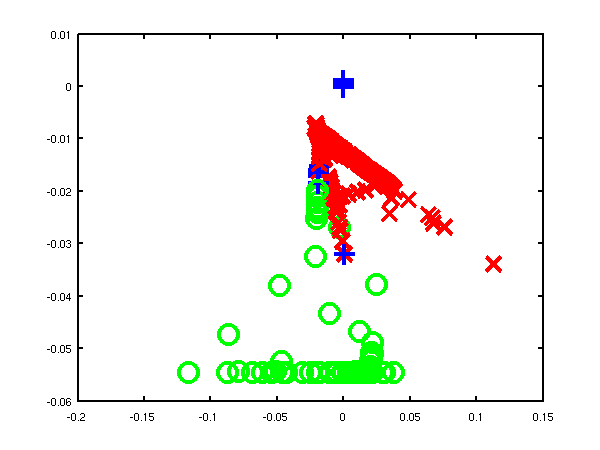

Matlab mltools Toolbox
======================

The main objective of this toolbox is to integrate several machine learning methods with in a consistent framework which is coded in a compatible way with the methods available in the other toolboxes on this site. Whilst the other toolboxes typically reflect research projects, this toolbox reflects other researchers work or known algorithms. The code either provides 'wrappers' for other researchers code or independent implementations. Examples of code that is wrapped include Isomap, MVU and NETLAB.

Background details for submitted software.

You need the following additional pieces of software to operate mltools.

For general utilities

- [ndlutil](https://github.com/SheffieldML/ndlutil/)

For optimization 

- [optimi](https://github.com/SheffieldML/ndlutil/)
- [netlab](https://github.com/sods/netlab/)

For downloading datasets

- [datasets](https://github.com/SheffieldML/datasets/) 

For spectral dimensionality reduction functionality

- [mvu](http://www.cse.wustl.edu/~kilian/code/files/mvu2012.zip)
- [lle](https://www.cs.nyu.edu/~roweis/lle/code.html)
- [jdqr](http://www.staff.science.uu.nl/~vorst102/JDQR.html)
- [isomap](http://isomap.stanford.edu/)        
- [sedumi](https://github.com/sqlp/sedumi/)      

Fix to re-enable `hgplvm` visualization.

#### Version 0.138

Minor tweak of model write result and model load result to allow specification of the data loading function.

#### Version 0.137

Release for release of `vargplvm` with dynamics.

#### Version 0.136

Minor mods.

#### Version 0.135

Minor mods.

#### Version 0.134

Added pmvu model.

#### Version 0.133

Added functionality for writing model files using `modelDeconstruct` commands to keep written files smaller.

#### Version 0.132

Add click visualise functionality for LVM visualization, Laplacian eigenmaps and wrapper for MVU.

#### Version 0.1311

Minor change to lvmScatterPlot to fix bug caused when minimum values were positive.

#### Version 0.131

Minor changes to toolbox to fix reading in of C++ code.

#### Version 0.13

Added `paramNameRegularExpressionLookup.m` to regular expression match a parameter name in a model and return the associated indices. `paramNameReverseLookup.m` does the same thing but for the specific parameter name. Also added multimodel type, which allows for multi-task style learning of existing models. Added linear mapping type of model.

#### Version 0.1291

Changes to `modelOutputGrad.m`, `modelOut.m`, `kbrOutputGrad.m`, `kbrExpandParam.m`, `modelOptimise.m` to allow compatibility with `sgplvm` and `ncca` toolboxes. Added a preliminary coding of LLE.

Note that to run the LLE code you will need to download the file `eigs_r11.m`

#### Version 0.129

Several changes for ICML dimensionality reduction tutorial, including adding density networks and GTM code as well as various latent variable visualisation code such as lvmTwoDPlot and lvmVisualise.

Added dnet type model for GTM and density networks. Added various lvm helper files for doing nearest neighbour and plotting results for latent variable models. Added lmvu and mvu embedding wrapper. Added ppca model type. Added output gradients for model out functions (for magnification factor computation in dnet models). Added helpers for reading various models from FID mapmodel, matrix etc.). Added rbfOutputGradX and visualisation for spring dampers type.

#### Version 0.128

Fixed Viterbi alignment algorithm, thanks to Raquel Urtasun for pointing out the problems with it.

Carl Henrik Ek added embeddings with maximum variance unfolding (landmark and normal) to the toolbox. Also several files modified by Carl Henrik to allow a single output dimension of a model to be manipulated.

#### Version 0.127

Minor modifications including adding file modelAddDynamics to replace fgplvmAddDynamics.

#### Version 0.126

Modified kbrParamInit to scale alpha weights and biases by number of data. Added 'dynamicsSliderChange' to lvmClassVisualise to allow visulisation of models with 'gpTime' style-dynamics.

#### Version 0.125

Added multimodel for learning multiple indepedent models with shared parameters.

#### Version 0.124

Added periodic RBF network and model gradient checker.

#### Version 0.123

Minor release in line with IVM toolbox 0.4.

#### Version 0.122

Added Hessian code for base model type and for MLP. Added Viterbi alignment code, viterbiAlign.

#### Version 0.121

Various minor bug fixes and changes which seem to have gone undocumented.

#### Version 0.12

Extended model type to be a generic container module for optimising any model. Added model test for testing a created model. The code is still in a bit of flux though with some design decisions not made and some code untested.

#### Version 0.111

Fixed bug in kbr where bias parameter fields where still being referred to as b.Also acknowledged the fact that the isomap graph may not be fully connected in isomapEmbed, but don't yet deal with it properly. Finally added lleEmbed.m for wrapping the lle code.

#### Version 0.11

Updated release for operation with FGPLVM toolbox 0.13. Structure of model creation changed and functions of the form modelOptions.m included for setting default options of the various machine learning models.

#### Version 0.1

The first release of the toolbox with various wrappers for NETLAB functions. Also latent variable model visualisation code was moved into this toolbox.

Examples
--------

### LLE

#### The Swiss Roll

The 'swiss roll data' is often used to illustrate dimensionality reduction algorithms despite the fact that it is very unrepresentative of real data sets.

In the first examples we use 1000 data points to represent the swiss roll, `demSwissRollLle1.m` and `demSwissRollLle2.m`.

 *Left*: LLE on the swiss roll data using 4 neighbours. *Right*: LLE on the swiss roll data using 8 neighbours.
In the next examples we use 3000 data points to represent the swiss roll, `demSwissRollFullLle1.m` and `demSwissRollFullLle2.m`.

 *Left*: LLE on the full swiss roll data using 4 neighbours. *Right*: LLE on the full swiss roll data using 8 neighbours.
#### Oil Data

The 'oil data' is commonly used as a bench mark for visualisation algorithms. For more details on the data see [this page](http://www.ncrg.aston.ac.uk/GTM/3PhaseData.html).

In these examples we used the 1000 data points from the training data for the oil, `demOilLle1.m` and `demOilLle2.m`.

 *Left*: LLE on the oil data using 4 neighbours, 9 errors when using classification by nearest neighbour in the latent space. *Right*: LLE on the oil data using 8 neighbours, 151 errors when using classification by nearest neighbour in the latent space.

Page updated on Sun Jun 17 08:48:04 2012
