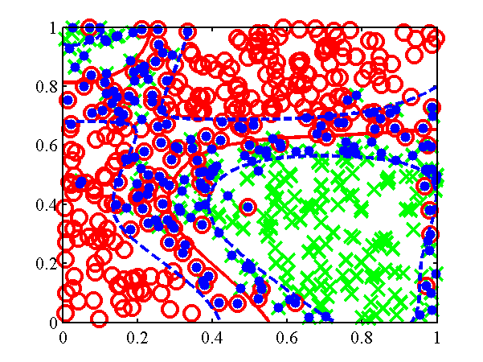
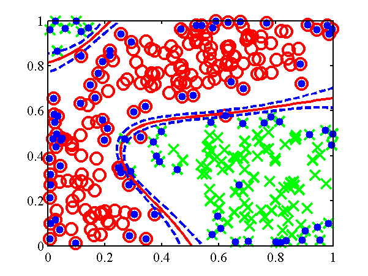

IVM Software
============

This page describes examples of how to use the informative vector machine Software (IVM).

Release Information
-------------------

Current release is 0.4.

As well as downloading the IVM software you need to obtain the toolboxes specified below.

| **Toolbox**                                  | **Version** |
|----------------------------------------------|-------------|
| [KERN](/kern/downloadFiles/vrs0p165)         | 0.165       |
| [PRIOR](/prior/downloadFiles/vrs0p131)       | 0.131       |
| [OPTIMI](/optimi/downloadFiles/vrs0p132)     | 0.132       |
| [ROCHOL](/rochol/downloadFiles/vrs0p12)      | 0.12        |
| [NDLUTIL](/ndlutil/downloadFiles/vrs0p155)   | 0.155       |
| [MLTOOLS](/mltools/downloadFiles/vrs0p123)   | 0.123       |
| [DATASETS](/datasets/downloadFiles/vrs0p131) | 0.131       |
| [NOISE](/noise/downloadFiles/vrs0p14)        | 0.14        |

Finally you will also need the [NETLAB toolbox](http://www.aston.ac.uk/eas/research/groups/ncrg/resources/netlab/downloads/) in your path and Anton Schwaighofer's SVM light MATLAB interface, available [here](http://staffwww.dcs.shef.ac.uk/people/N.Lawrence/software/svml_toolbox.html) to run the `demThreeFive` example which compares with [SVM light](http://svmlight.joachims.org/) version 5.00.

Examples
--------

`demClassification1`
--------------------

The first example given is `demClassification1` which is a simple classification data set, where only one direction of the input is relevant in determining the decision boundary. An ARD MLP kernel is used in combination with a linear kernel. The ARD parameters in the linear and MLP kernel are constrained to be the same by the line:

```matlab
% Constrain the ARD parameters in the MLP and linear kernels to be the same.
model.kern = cmpndTieParameters(model.kern, {[4, 7], [5, 8]});
```

The resulting classification is shown below.


ecision boundary from the `demClassification1.m` example. Postive class is red circles, negative class green crosses and active points are yellow dots. Decision boundary shown in red, contours at 0.25 and 0.75 probability shown in blue.

`demClassification2`
--------------------

The second example attempts to learn a Gaussian process give data that is sampled from a Gaussian process. The code is `demClassification2`. The underlying Gaussian process is based on an RBF kernel with variance inverse width 10. The IVM learns an inverse width of 15 and gives the classification is shown below.



Decision boundary from the `demClassification2.m` example. Postive class is red circles, negative class green crosses and active points are yellow dots. Decision boundary shown in red, contours at 0.25 and 0.75 probability shown in blue.

`demClassification3`
--------------------

This example is similar to `demClassification2`, only now there is a null category region in the data (a region of low data density between the classes). The example is for comparison with the null category noise model.



Decision boundary from the `demClassification3.m` example. Postive class is red circles, negative class green crosses and active points are yellow dots. Decision boundary shown in red, contours at 0.25 and 0.75 probability shown in blue.

`demOrdered1`
-------------

In this example the ordered categorical noise model is used (ordinal regression). The data is a simple data set for which a linear one dimensional model suffices. The IVM is given a combination of an RBF and linear kernel with ARD.For the ordered categorical case there are several parameters associated with the noise model (in particular the category widths), these are learnt too. The model learns that the system is linear and only one direction is important. The resulting classification is given below.


Decision boundary from the `demOrdered1.m` example. Class 0 - red cross, Class 1 - green circles, Class 2 - blue crosses, Class 3 - cyan asterisks, Class 4 - pink squares, Class 5 - yellow diamonds. Class 6 - red triangles. Active points are yellow dots, note that because the kernel is linear by now the most informative points tend to be at the extrema. Decision boundaries shown in red, contours at 0.25 and 0.75 probability shown in blue.

`demOrdered2`
-------------

Another example with the ordered categorical noise model, here the data is radial, the categories being along the radius of a circle. The IVM is given a combination of an RBF and linear kernel with ARD. Again there are several parameters associated with the noise model, and these are learnt using `ivmOptimiseNoise`. The resulting classification is given below.


Decision boundary from the `demOrdered1.m` example. Class 0 - red cross, Class 1 - green circles, Class 2 - blue crosses, Class 3 - cyan asterisks, Class 4 - pink squares, Class 5 - yellow diamonds. Class 6 - red triangles. Active points are yellow dots, note that because the kernel is linear by now the most informative points tend to be at the extrema. Decision boundaries shown in red, contours at 0.25 and 0.75 probability shown in blue.

`demRegression1`
----------------

In this example the Gaussian noise model is used (standard regression). The data is sampled from a Gaussian process, only one input dimension is important. The IVM is given a combination of an RBF and linear kernel with ARD. The resulting regression is given below.


Regression from the example `demRegression1.m`. Targets are red dots and active points are yellow dots.

`demRegression2`
----------------

A second example with Gaussian noise, sampled from a Gaussian process, but this time with differing length scales.


Regression from the example `demRegression2.m`. Targets are red dots and active points are yellow dots.

Benchmark Data Sets
-------------------

The function `ivmGunnarData` allows you to test the IVM on Gunnar Raetsch's benchmark data sets. Download the data sets, [from here](http://ida.first.fraunhofer.de/projects/bench/benchmarks.htm) and expand the ringnorm data set into '$DATASETSDIRECTORY/gunnar/ringnorm'. Then run the following script.
`  >>ivmGunnarData('ringnorm', 1, {'rbf', 'bias', 'white'}, 1, 100)  ...    Final model:  IVM Model:   Noise Model:    Probit bias on process 1: 0.0439    Probit Sigma2: 0.0000   Kernel:    Compound kernel:      RBF inverse width: 0.0866 (length scale 3.3984)      RBF variance: 1.2350      Bias Variance: 8.2589      White Noise Variance: 0.0000  Test Error 0.0183  Model likelihood -56.7120 `

You can try any of the data sets by replacing ringnorm with the relevant data set (note that they don't all work with only 100 active points inas in the example above, for example the 'banana' data set needs 200 active points to get a reasonable result,

```matlab
>> ivmGunnarData('banana', 1, {'rbf', 'bias', 'white'}, 1, 200)  ...
Final model:  IVM Model:
Noise Model:    Probit
bias on process 1: 0.1067
Probit Sigma2: 0.0000
Kernel:    Compound
kernel:      RBF inverse width: 1.6411 (length scale 0.7806)
RBF variance: 0.2438
Bias Variance: 0.0000
White Noise Variance: 0.0148
Test Error 0.1129
Model likelihood 175.3588
```


Decision boundary from the banana example. Postive class is red circles, negative class green crosses and active points are yellow dots. Decision boundary shown in red, contours at 0.25 and 0.75 probability shown in blue.

Null Category Noise Model
-------------------------

Examples
--------

The toy data example in the papers can be recreated using:

```
>> demUnlabelled1
```

and leads to the decision boundary given below. A standard IVM based classifier can be run on the data using

```
>> demUnlabelled2
```


The null category noise model run on toy data. *Top*: using the null category, the true nature of the decision boundary is recovered. *Bottom*: the standard IVM, does not recover the true decision boundary.
The other USPS digit classification example given in the NIPS paper can be re-run with:

```
>> demThreeFive
```

Be aware that this code can take some time to run. The results, in the form of averaged area under ROC curve against probability of missing label, can be plotted using

```
>> demThreeFiveResults
```
Plot of average area under ROC curve against probability of label being present. The red line is the standard IVM based classifier, the blue dotted line is the null category noise model based classifier, the green dash-dot line is the a normal SVM and the mauve dashed line is the transductive SVM.

Page updated on Sat Jan 13 01:05:38 2007
