GP Single Input Motif Module Software
=====================================

This page describes examples of how to use the Gaussian process single input motif module modelling software (`gpsim`).

If you are looking for general Gaussian process implementations please check [here](/gpsoftware.html).

### Release Information

**Current release is 0.1211**.

As well as downloading the `gpsim` software you need to obtain the toolboxes specified below. 

- [netlab](https://github.com/sods/netlab) mainly used for optimization utilities (like scg).

- [prior](https://github.com/SheffieldML/prior) prior distributions.
- [optimi](https://github.com/SheffieldML/optimi) optimization constriant mappings.
- [kern](https://github.com/SheffieldML/kern) covariance functions.
- [ndlutil](https://github.com/SheffieldML/ndlutil) various utility functions.
- [noise](https://github.com/SheffieldML/noise) noise models.
- [mltools](https://github.com/SheffieldML/mltools) machine learning models.

- [Carl Rasmussen's minimize](http://learning.eng.cam.ac.uk/carl/code/minimize/minimize.m)

Minor bug fix in `demBarenco1.m`

#### Release 0.121

Minor fixes of the code for dealing with white noise handling in multiKern.

#### Release 0.12

Release with scripts to recreate results in prepared journal paper.

#### Release 0.11

This follow up release was for the NIPS paper.

#### Release 0.1

This was the first release and included software used to create preliminary results to be submitted to the Gaussian Processes in Practice Workshop.

The toolboxes required to run the `gpsim` toolbox are listed below.

### Examples

#### Linear Solution

For the moment there are two examples of the linear solution given in the toolbox. They are `demBarenco1` and `demBarenco2`. They fit a Gaussian process model to the single input module associated with p53. `demBarenco1` used the pre-processed data by PUMA package which shows the results displayed in the ECCB submitted paper Figure 1. `demBarenco2` used the pre-processed data by MAS5 method which is exactly same as the one Barenco used in their paper. The original work is described in [Barenco *et al.*](http://www.cs.man.ac.uk/neill-bin/publications/bibpage.cgi?keyName=Barenco:ranked06&printAbstract=1).

To run the example write

```matlab
>> demBarenco1
```

At the first time of running, it will take some time to load in the data from the excel spreadsheet files. The excel spreadsheets contain mmgMOS processed versions of the .cel files. This gives us a standard deviation associated with the expression level as well as the expression level itself. The .cel files are available on [ArrayExpress](http://www.ebi.ac.uk/arrayexpress/). Since they are in log space, they must first be transfered to non-log space. Once this process has been done, relevant profiles are extracted they are saved in a file called `./data/barencoPUMAdata.mat`. (Similarly, the associated data file for MAS5 pre-processing are saved in a file called `./data/barencoMASdata.mat`.) The variances and means computed are therefore the variance and mean of a log normal distribution. Obviously a Gaussian process can go negative but because the expressions are not in log space they can't go negative. This is clearly a weakness with this model.

Once the data has been extracted, conjugate gradient optimisation of the model commences. The first batch of numbers are a gradient check (the third column should be zeros).

The model that is being created is actually three models, one Gaussian process for each repeat that is in the data. The covariance parameters are shared though, this is a form of empirical hierarchical Bayes. The implicit assumption is that each repeat is generated by an independent sample of f(t) from a Gaussian process with the *same* covariance parameters. This seems reasonable given the biological experiments were from different .cel lines, *i.e.* they were not technical replicates. However [Barenco *et al.*](http://ml.sheffield.ac.uk/~neil/cgi-bin/publications/bibpage.cgi?keyName=Barenco:ranked06&printAbstract=1) seem to treat the data as if there is one f(t) for all replicates. We also tried this, and results (in terms of estimated degradation, sensitivity and basal transcription) were not significantly different.

We follow [Barenco *et al.*](http://ml.sheffield.ac.uk/~neil/cgi-bin/publications/bibpage.cgi?keyName=Barenco:ranked06&printAbstract=1) in fixing the degradation rate of *p21* to 0.8 hr<sup>-1</sup> and the sensitivity to 1.0.

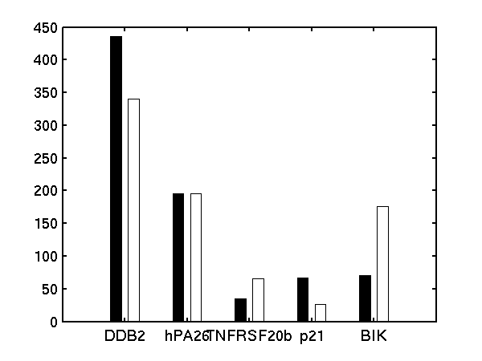
 
 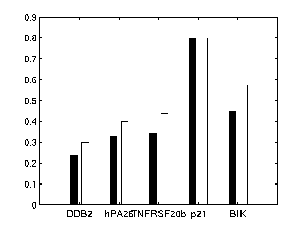

Bar charts of (left) basal transcription rate, (middle) sensitivity and (right) degradation rate. Black bars are results from [Barenco *et al.*](http://ml.sheffield.ac.uk/~neil/cgi-bin/publications/bibpage.cgi?keyName=Barenco:ranked06&printAbstract=1). White bars are from our `demBarenco1`.

 
 
Plots of the profiles predicted for each of the three replicates given in the experiments. Solid lines are mean predictions, dashed lines are two standard deviations of error, crosses are the points predicted from [Barenco *et al.*](http://ml.sheffield.ac.uk/~neil/cgi-bin/publications/bibpage.cgi?keyName=Barenco:ranked06&printAbstract=1) for the first replicate (scaled to match each profile).

### MAP Approximation for Non-Linear Response

There are three examples of the use of the MAP approximation, the first is `demBarencoMap1` which is the experiment shown in the Figure 2 in the ECCB submitted paper. We implemented the Michaelis Menten kinetics for the p53 data in this experiment.

To run the example write

```matlab
>> demBarencoMap1 
```


 
 

Plots of the profiles predicted for each of the three replicates given in the experiments. Solid lines are mean predictions, dashed lines are two standard deviations of error.
The second is `demBarencoMap2` which is a simple exponential response with an MLP style kernel as a prior over the transcription factor concentration, and the third is `demBarencoMap3` which is a recreation of the linear experiment given above, made as a sanity check.

#### Repression Solution

For the moment there is only one example of the repression case given in the toolbox. It is `demEcoliMap1` which fits a Gaussian process model to the single input module associated with E. coli data set. `demEcoliMap1` used the same microarray data as [Khanin *et al.*, 2006](http://ml.sheffield.ac.uk/~neil/cgi-bin/publications/bibpage.cgi?keyName=Khanin:repression06&printAbstract=1). They identify 14 target genes which are repressed by the TF LexA and the mRNA measurement for these genes are collected over six time points.

To run the example write

```matlab
>> demEcoliMap1 
```


Plots of the predicted TF profile. Solid lines are mean predictions, dashed lines are two standard deviations of error.
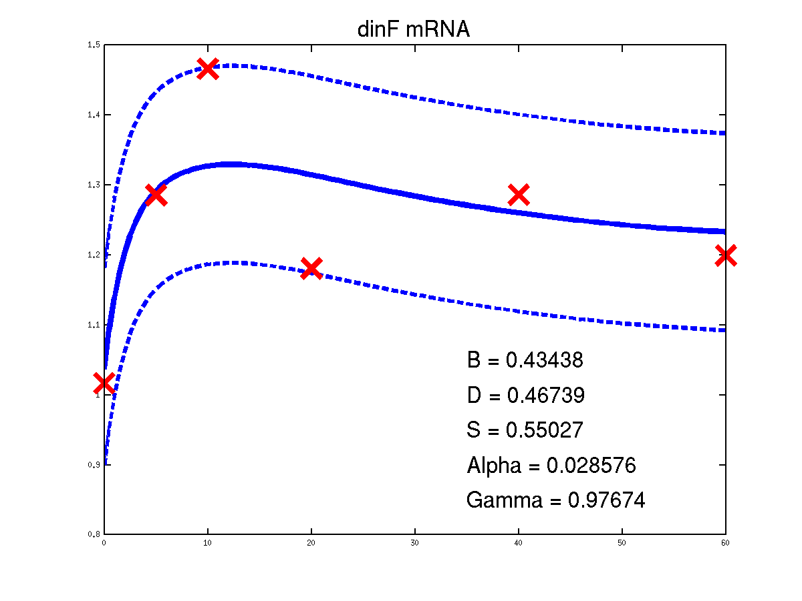
 
 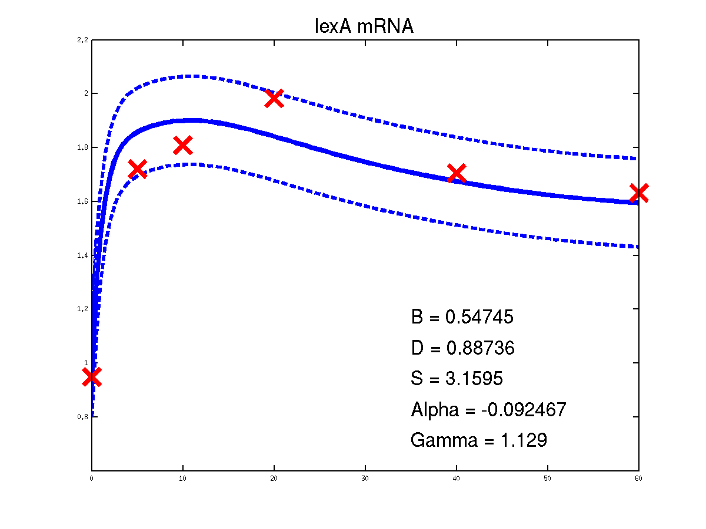
 
 
 
 
 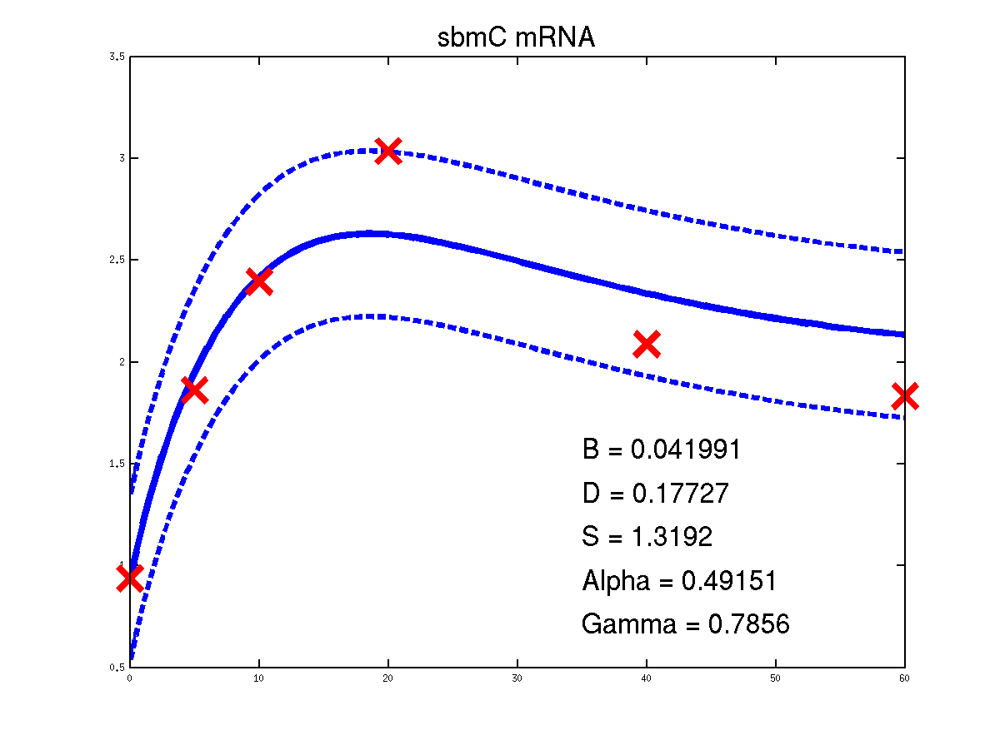
 
 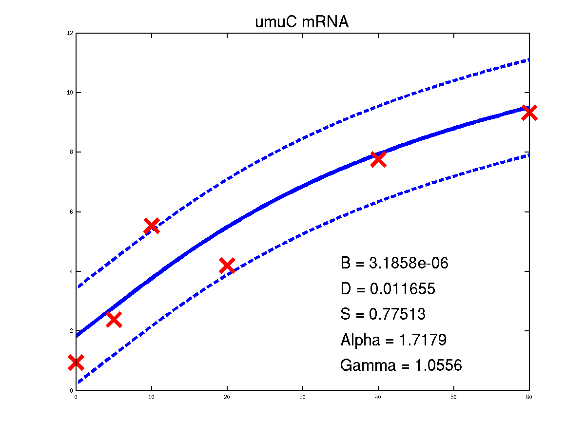
 
 
 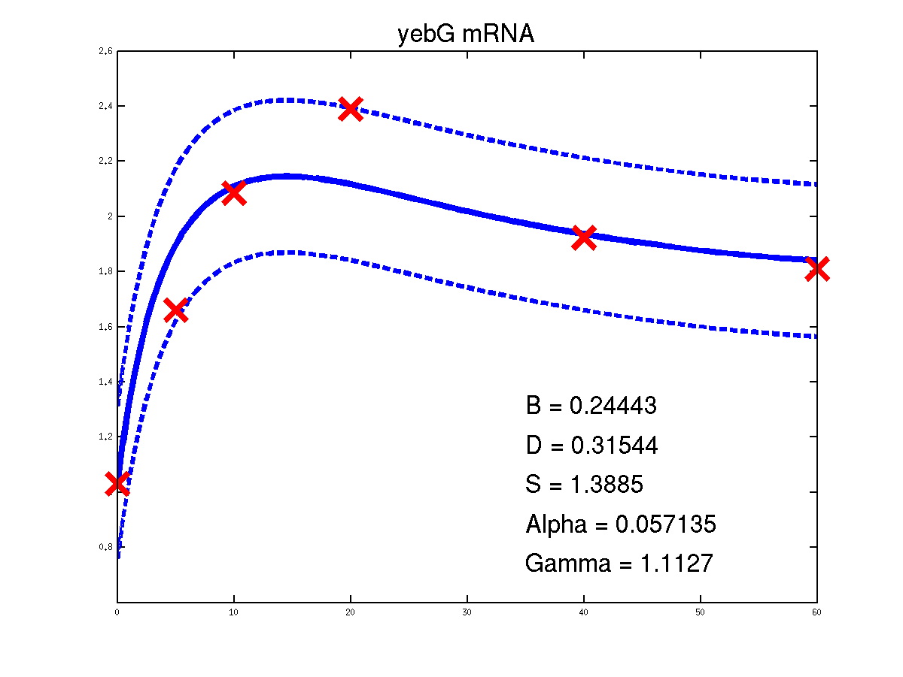
 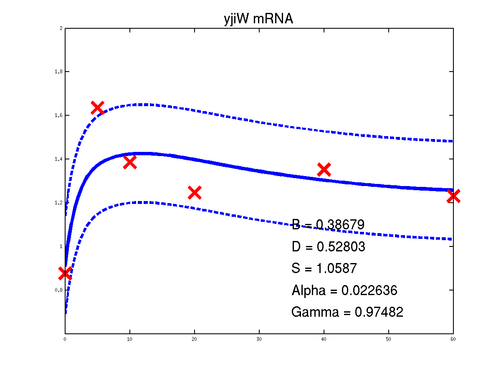

Predicted expression levels for all 14 target genes. Parameters shown were obtained by maximum likelihood. Standard errors were not available for this two-dye microarray data. There is no replica and therefore a gene-specifec noise variance parameter was estimated for each target gene. Data and reconstructed profiles are given in the original scale. Times is measured in minutes.
#### Cascaded Differential Equations

The last example shows a simple cascade of differential equations. We applied the driven input model to a simple cascade in Drosophila mesoderm development, focusing on the transcription factor Mef2 (Myocyte enhancing factor 2). We selected six targets of Mef2 identified by Chromatin immunoprecipitation (ChIP-chip) assays [[Sandmann *et al.*, 2006](http://ml.sheffield.ac.uk/~neil/cgi-bin/publications/bibpage.cgi?keyName=Sandmann:temporal06&printAbstract=1)] and which were observed to be up-regulated after Mef2 is expressed. Affymetrix time course microarray data from wild-type embryos [[Tomancak *et al.*, 2002](http://ml.sheffield.ac.uk/~neil/cgi-bin/publications/bibpage.cgi?keyName=Tomancak:systematic02&printAbstract=1)] provides us with observations of Mef2 expression (y(t)) and the expression of the target genes xj (t) at hourly intervals. The microarray time course was replicated three times, and we used all three replicates to train the model parameters. The raw data was downloaded from <ftp://ftp.fruitfly.org/pub/embryo_tc_array_data/>. the relevant profile (including selected target genes' names, expression levels and standard errors) for generating the results shown in the submitted paper are saved in a file called `./data/mef2Data.mat`.

To run the example write

```matlab
>> demGpdisimMef2 
```

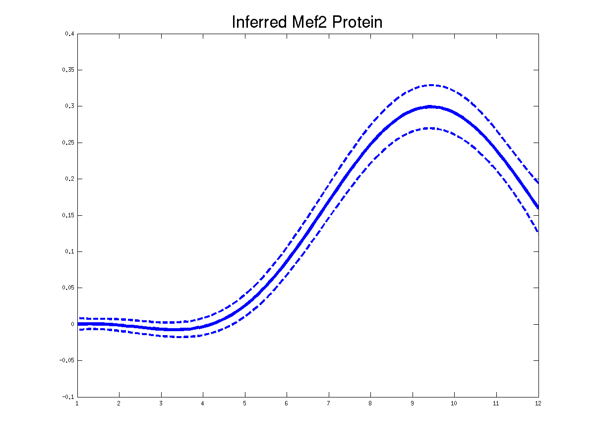
 
 
Plots of the predicted TF profiles for three replicas. Solid lines are mean predictions, dashed lines are two standard deviations of error.

 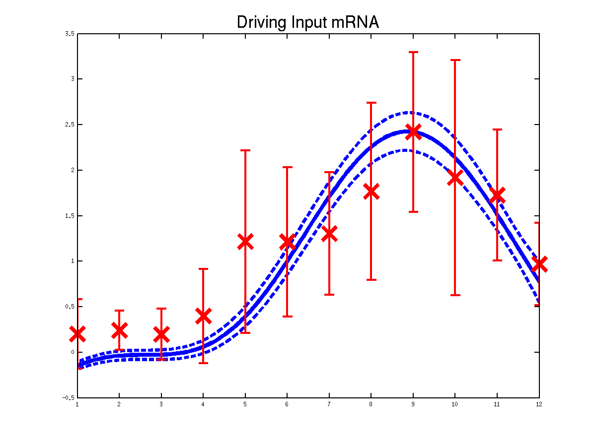
 
Plots of the predicted driving input Mef2 mRNA profiles for three replicas. Solid lines are mean predictions, dashed lines are two standard deviations of error.

 
 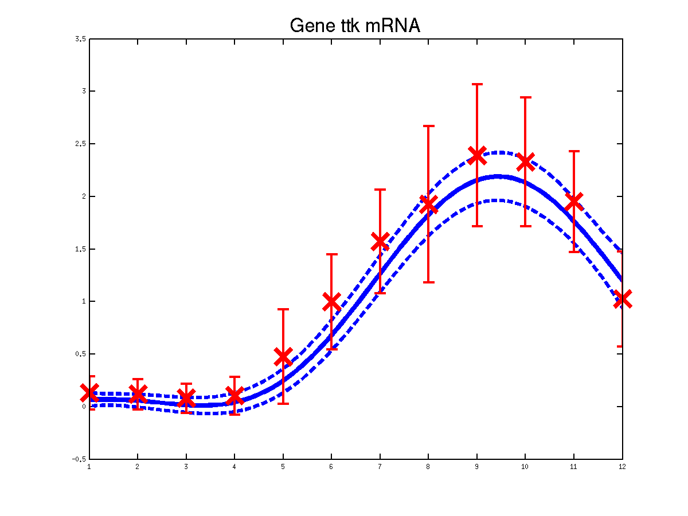
 
 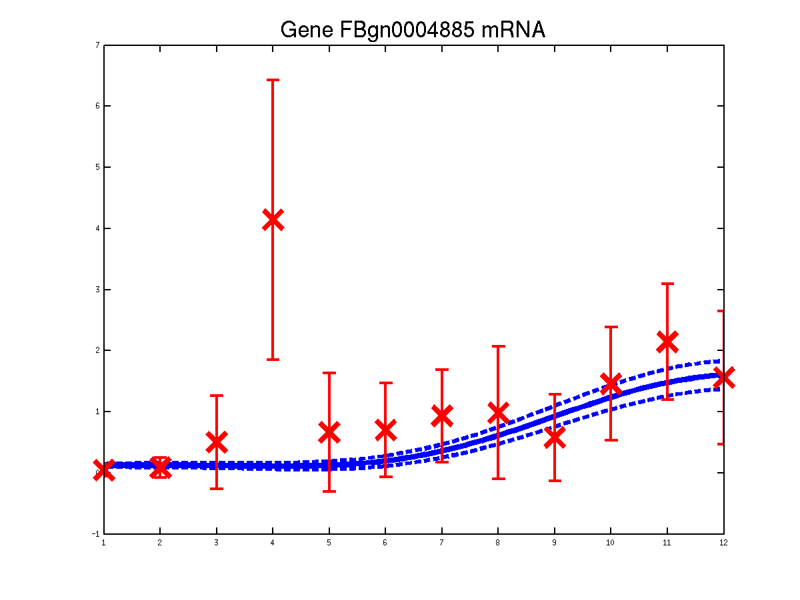
 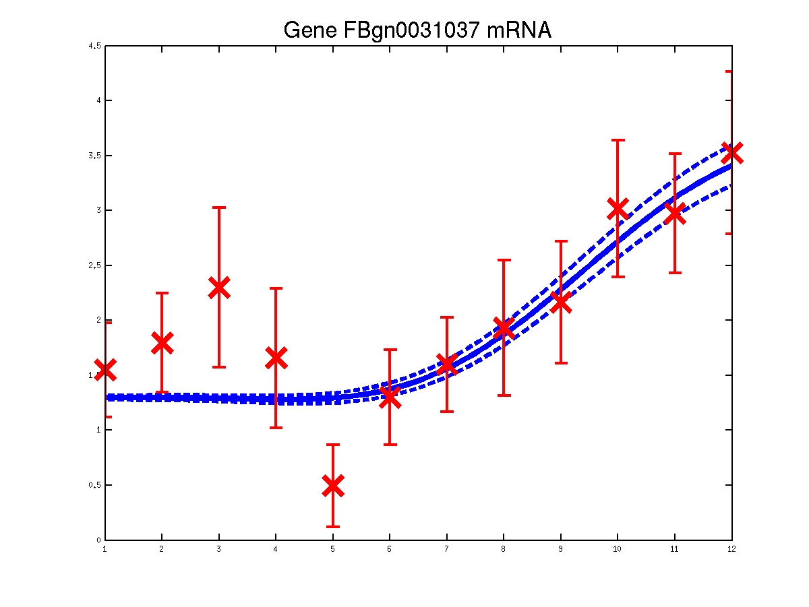
Predicted expression levels for all 6 target genes for one replica as examples.

Page updated on Tue May 19 11:09:49 2009


